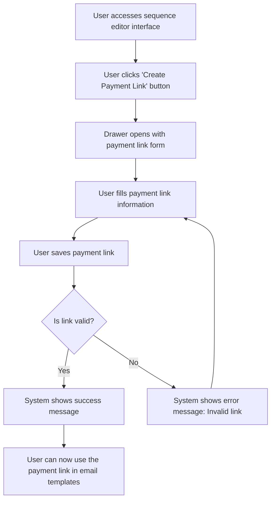

# US001 - Créer un Lien de Paiement

## Description
En tant qu'utilisateur, je veux créer un lien de paiement personnalisé pour mes emails.

## Préconditions
- L'utilisateur est connecté.
- L'utilisateur a accès à la page de gestion des liens de paiement.

## Scénario Principal
1. L'utilisateur accède à l'interface editor de la séquence.
2. L'utilisateur clique sur un bouton pour créer un lien de paiement.
3. Un drawer s'ouvre avec un formulaire pour créer le lien de paiement.
4. L'utilisateur remplit les informations du lien de paiement :
   - URL de base
   - Variables dynamiques (par exemple, `[[nfacture]]`, `[[montant]]`)
5. L'utilisateur enregistre le lien de paiement.
6. Le système affiche un message de succès.

## Notes
- Il est aussi possible de créer un profil SMTP depuis l'interface editor de la séquence en cliquant sur un bouton qui ouvre un drawer avec l'include de ce composant.

## Scénario Alternatif
- **Lien Invalide** : Si le lien de paiement est invalide, le système affiche un message d'erreur et demande à l'utilisateur de le corriger.

## Postconditions
- Le lien de paiement est créé et enregistré dans la base de données.
- Le lien de paiement est disponible pour une utilisation dans les templates d'emails.

## Notes
- Les liens de paiement doivent être personnalisables avec des variables dynamiques.
- Les liens de paiement doivent être validés avant d'être enregistrés.

## User Flow Diagram


## Wireframes

### Écran Sequence Editor Interface
```
+-----------------------------------------------------+
| Modifier la Séquence                                |
+-----------------------------------------------------+
|                                                     |
| Modifier les templates d'emails et configurer les   |
| délais                                              |
|                                                     |
| Canvas: Zone de glisser-déposer pour les templates  |
| d'emails et les nœuds filtres                       |
|                                                     |
| Barre latérale: Liste des templates d'emails et des |
| nœuds filtres disponibles                           |
|                                                     |
| [Sauvegarder] [Annuler]                             |
|                                                     |
+-----------------------------------------------------+
```

### Écran Email Node Editor
```
+-----------------------------------------------------+
| Modifier le Template d'Email                         |
+-----------------------------------------------------+
|                                                     |
| Modifier le template d'email en utilisant des      |
| variables dynamiques                                |
|                                                     |
| Objet : [_______________________________________]   |
| CC : [_________________________________________]   |
| Profil SMTP : [_________________________________]   |
| Délai : [____] jours                                |
|                                                     |
| Barre d'outils: Options de formatage (gras,        |
| italique, etc.)                                     |
| Zone d'édition: Éditeur de texte riche pour le    |
| contenu de l'email                                  |
|                                                     |
| [Créer un Lien de Paiement] [Sauvegarder] [Annuler] |
|                                                     |
+-----------------------------------------------------+
```

### Écran Create Payment Link Drawer
```
+-----------------------------------------------------+
| Créer un Lien de Paiement                           |
+-----------------------------------------------------+
|                                                     |
| Remplissez les détails du lien de paiement          |
|                                                     |
| URL de base : [_______________________________]     |
| Variables dynamiques : [_______________________]   |
| Exemple : [[nfacture]], [[montant]]                  |
|                                                     |
| [Sauvegarder le Lien] [Annuler]                      |
|                                                     |
+-----------------------------------------------------+
```

### Écran Success Message
```
+-----------------------------------------------------+
| Lien de Paiement Créé                               |
+-----------------------------------------------------+
|                                                     |
| Votre lien de paiement a été créé avec succès      |
|                                                     |
| Le lien de paiement a été enregistré.               |
|                                                     |
| [Utiliser le Lien] [Fermer]                         |
|                                                     |
+-----------------------------------------------------+
```

### Écran Error Message
```
+-----------------------------------------------------+
| Erreur                                               |
+-----------------------------------------------------+
|                                                     |
| Une erreur est survenue lors de la création du     |
| lien de paiement                                    |
|                                                     |
| Veuillez vous assurer que le lien est valide.      |
|                                                     |
| [Réessayer] [Annuler]                                |
|                                                     |
+-----------------------------------------------------+
```

### Écran Edit Payment Link Drawer
```
+-----------------------------------------------------+
| Modifier le Lien de Paiement                        |
+-----------------------------------------------------+
|                                                     |
| Modifiez les détails du lien de paiement            |
|                                                     |
| URL de base : [_______________________________]     |
| Variables dynamiques : [_______________________]   |
| Exemple : [[nfacture]], [[montant]]                  |
|                                                     |
| [Sauvegarder les Modifications] [Annuler]           |
|                                                     |
+-----------------------------------------------------+
```

### Écran Delete Payment Link Confirmation
```
+-----------------------------------------------------+
| Supprimer le Lien de Paiement                        |
+-----------------------------------------------------+
|                                                     |
| Êtes-vous sûr de vouloir supprimer ce lien de       |
| paiement ?                                          |
|                                                     |
| Cette action est irréversible.                      |
|                                                     |
| [Confirmer] [Annuler]                                |
|                                                     |
+-----------------------------------------------------+
```

### Écran Delete Success Message
```
+-----------------------------------------------------+
| Lien de Paiement Supprimé                           |
+-----------------------------------------------------+
|                                                     |
| Votre lien de paiement a été supprimé avec succès  |
|                                                     |
| Le lien de paiement a été retiré de la base de      |
| données.                                            |
|                                                     |
| [Fermer]                                             |
|                                                     |
+-----------------------------------------------------+
```