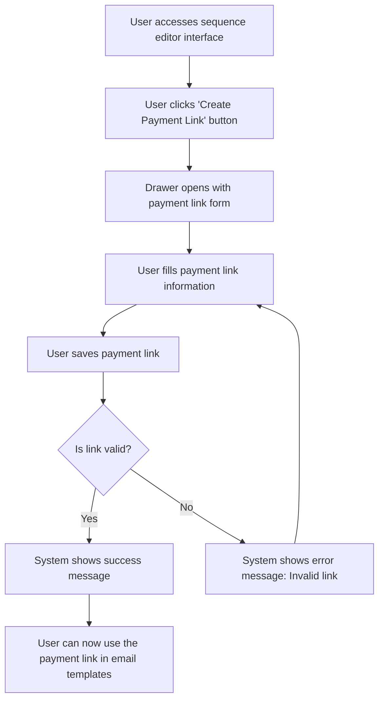

# Design: Create Payment Link

## Technical Approach
The create payment link feature will allow users to create a customized payment link for their emails. The system will provide a drawer with a form to input the payment link details, including a base URL and dynamic variables. The frontend will use Alpine.js for reactivity and state management, while the backend will handle data storage via Flask.

## Architecture Decisions

### Decision: Use Alpine.js for Frontend Reactivity
- **Description**: Alpine.js will manage the state and reactivity of the payment link creation process.
- **Rationale**: Alpine.js is lightweight and integrates seamlessly with HTML, making it ideal for this use case.
- **Impact**: Simplifies frontend logic and improves user experience.

### Decision: Use Flask for Backend Processing
- **Description**: Flask will handle the payment link creation and data storage operations.
- **Rationale**: Flask is lightweight and well-suited for handling HTTP requests and integrating with Parse.
- **Impact**: Ensures robust backend processing and easy integration with the database.

### Decision: Use Drawer for Form Display
- **Description**: The payment link form will be displayed in a drawer that slides out from the side of the screen.
- **Rationale**: A drawer provides a non-intrusive way to display the form while keeping the main interface visible.
- **Impact**: Improves user experience by allowing easy access to the form without losing context.

### Decision: Support Dynamic Variables
- **Description**: The payment link will support dynamic variables (e.g., `[[nfacture]]`, `[[montant]]`).
- **Rationale**: Dynamic variables allow for personalized payment links that can be tailored to each invoice.
- **Impact**: Enhances the flexibility and usability of payment links.

### Decision: Validate Payment Links
- **Description**: The system will validate payment links before saving them to ensure they are correctly formatted.
- **Rationale**: Validation ensures that payment links are functional and reduces errors.
- **Impact**: Improves data quality and user experience.

## Data Flow


## Data Mapping

### Parse Class: `PaymentLinks`
- **Fields**:
  - `baseUrl`: String (base URL for the payment link).
  - `dynamicVariables`: Array (list of dynamic variables used in the payment link).
  - `createdAt`: DateTime (timestamp of when the payment link was created).
  - `updatedAt`: DateTime (timestamp of when the payment link was last updated).

### Alpine.js Store: `paymentLinkCreation`
- **Fields**:
  - `baseUrl`: String (base URL for the payment link).
  - `dynamicVariables`: Array (list of dynamic variables used in the payment link).
  - `isDrawerOpen`: Boolean (indicates if the drawer is open).
  - `errorMessage`: String (error message to display).
  - `successMessage`: String (success message to display).

### Data Flow
1. **Input Data**:
   - The user clicks the 'Create Payment Link' button in the sequence editor interface.
   - The system opens a drawer with a form to input the payment link details.

2. **Form Submission**:
   - The user fills in the base URL and dynamic variables for the payment link.
   - The user submits the form to save the payment link.

3. **Validation**:
   - The system validates that the payment link is correctly formatted and includes valid dynamic variables.
   - If the link is invalid, the system displays an error message and prompts the user to correct it.

4. **Saving**:
   - The system saves the payment link details to the `PaymentLinks` class in Parse.
   - The system displays a success message upon successful saving.

5. **Usage**:
   - The user can now use the payment link in email templates.

## Screen ASCII

### Screen 1: Sequence Editor Interface
```
┌───────────────────────────────────────────────────────────────────────────────┐
│                                                                           │
│                                                                               │
│  Edit Sequence                                                                │
│  Edit email templates and configure delays                                   │
│                                                                               │
│  Canvas: Drag-and-drop area for email templates and filter nodes            │
│                                                                               │
│  Sidebar: List of available email templates and filter nodes                 │
│                                                                               │
│  [Save]  [Cancel]                                                             │
│                                                                               │
│                                                                           │
└───────────────────────────────────────────────────────────────────────────────┘
```

### Screen 2: Email Node Editor
```
┌───────────────────────────────────────────────────────────────────────────────┐
│                                                                           │
│                                                                               │
│  Edit Email Template                                                         │
│  Edit the email template using dynamic variables                             │
│                                                                               │
│  Subject: [________________________________________________________________]   │
│  CC: [__________________________________________________________________]       │
│  SMTP Profile: [_______________________________________________________]       │
│  Delay: [____] days                                                           │
│                                                                               │
│  Toolbar: Formatting options (bold, italic, etc.)                             │
│  Editing Area: Rich text editor for email content                             │
│                                                                               │
│  [Create Payment Link]  [Save]  [Cancel]                                      │
│                                                                               │
│                                                                           │
└───────────────────────────────────────────────────────────────────────────────┘
```

### Screen 3: Create Payment Link Drawer
```
┌───────────────────────────────────────────────────────────────────────────────┐
│                                                                           │
│                                                                               │
│  Create Payment Link                                                         │
│  Fill in the payment link details                                            │
│                                                                               │
│  Base URL: [________________________________________________________]          │
│  Dynamic Variables: [_____________________________________________]          │
│  Example: [[nfacture]], [[montant]]                                           │
│                                                                               │
│  [Save Link]  [Cancel]                                                       │
│                                                                               │
│                                                                           │
└───────────────────────────────────────────────────────────────────────────────┘
```

### Screen 4: Success Message
```
┌───────────────────────────────────────────────────────────────────────────────┐
│                                                                           │
│                                                                               │
│  Payment Link Created                                                        │
│  Your payment link has been created successfully                              │
│                                                                               │
│  The payment link has been saved.                                            │
│                                                                               │
│  [Use Link]  [Close]                                                          │
│                                                                               │
│                                                                           │
└───────────────────────────────────────────────────────────────────────────────┘
```

### Screen 5: Error Message
```
┌───────────────────────────────────────────────────────────────────────────────┐
│                                                                           │
│                                                                               │
│  Error                                                                        │
│  An error occurred while creating the payment link                           │
│                                                                               │
│  Please ensure the link is valid.                                            │
│                                                                               │
│  [Retry]  [Cancel]                                                            │
│                                                                               │
│                                                                           │
└───────────────────────────────────────────────────────────────────────────────┘
```

### Screen 6: Edit Payment Link Drawer
```
┌───────────────────────────────────────────────────────────────────────────────┐
│                                                                           │
│                                                                               │
│  Edit Payment Link                                                           │
│  Edit the payment link details                                               │
│                                                                               │
│  Base URL: [________________________________________________________]          │
│  Dynamic Variables: [_____________________________________________]          │
│  Example: [[nfacture]], [[montant]]                                           │
│                                                                               │
│  [Save Changes]  [Cancel]                                                     │
│                                                                               │
│                                                                           │
└───────────────────────────────────────────────────────────────────────────────┘
```

### Screen 7: Delete Payment Link Confirmation
```
┌───────────────────────────────────────────────────────────────────────────────┐
│                                                                           │
│                                                                               │
│  Delete Payment Link                                                          │
│  Are you sure you want to delete this payment link?                          │
│                                                                               │
│  This action is irreversible.                                                │
│                                                                               │
│  [Confirm]  [Cancel]                                                           │
│                                                                               │
│                                                                           │
└───────────────────────────────────────────────────────────────────────────────┘
```

### Screen 8: Delete Success Message
```
┌───────────────────────────────────────────────────────────────────────────────┐
│                                                                           │
│                                                                               │
│  Payment Link Deleted                                                        │
│  Your payment link has been deleted successfully                              │
│                                                                               │
│  The payment link has been removed from the database.                        │
│                                                                               │
│  [Close]                                                                     │
│                                                                               │
│                                                                           │
└───────────────────────────────────────────────────────────────────────────────┘
```

## Components and Layouts

### Components/Partials Usage

#### Sequence Editor Component
- **File**: `/templates/partials/sequence_editor_component.html`
- **Role**: Handles the editing of a sequence, including accessing the payment link creation drawer.
- **Dependencies**:
  - `paymentLinkCreation` store for managing state.
  - `axiosParse` for API calls to Parse.

#### Email Node Editor Component
- **File**: `/templates/partials/email_node_editor_component.html`
- **Role**: Handles the editing of email templates, including creating payment links.
- **Dependencies**:
  - `paymentLinkCreation` store for managing state.

#### Create Payment Link Drawer Component
- **File**: `/templates/partials/create_payment_link_drawer_component.html`
- **Role**: Displays the form for creating a payment link in a drawer.
- **Dependencies**:
  - `paymentLinkCreation` store for managing state.

#### Edit Payment Link Drawer Component
- **File**: `/templates/partials/edit_payment_link_drawer_component.html`
- **Role**: Displays the form for editing a payment link in a drawer.
- **Dependencies**:
  - `paymentLinkCreation` store for managing state.

#### Delete Payment Link Confirmation Component
- **File**: `/templates/partials/delete_payment_link_confirmation_component.html`
- **Role**: Displays a confirmation message before deleting a payment link.
- **Dependencies**:
  - `paymentLinkCreation` store for managing state.

#### Success Message Component
- **File**: `/templates/partials/success_message_component.html`
- **Role**: Displays a success message after a payment link is created or deleted.
- **Dependencies**:
  - `paymentLinkCreation` store for managing state.

#### Error Message Component
- **File**: `/templates/partials/error_message_component.html`
- **Role**: Displays error messages during the payment link creation process.
- **Dependencies**:
  - `paymentLinkCreation` store for managing state.

### Layouts

#### Base Layout
- **File**: `/templates/layouts/base_layout.html`
- **Role**: Provides the basic structure for all pages, including the header, footer, and main content area.

#### Dashboard Layout
- **File**: `/templates/layouts/dashboard_layout.html`
- **Role**: Provides the structure for dashboard pages, including the header, sidebar, and main content area.
- **Components Used**:
  - `sidebarComponent`

## Data Parse Changes

### Class: `PaymentLinks`
- **New Class**:
  - `PaymentLinks` will store payment link information, including base URL, dynamic variables, and timestamps.

## File Changes

### New Files
- `/templates/partials/sequence_editor_component.html`: Component for editing sequences.
- `/templates/partials/email_node_editor_component.html`: Component for editing email templates.
- `/templates/partials/create_payment_link_drawer_component.html`: Component for creating payment links.
- `/templates/partials/edit_payment_link_drawer_component.html`: Component for editing payment links.
- `/templates/partials/delete_payment_link_confirmation_component.html`: Component for confirming payment link deletion.
- `/templates/partials/success_message_component.html`: Component for displaying success messages.
- `/templates/partials/error_message_component.html`: Component for displaying error messages.
- `/static/js/stores/paymentLinkCreationStore.js`: Alpine.js store for managing payment link creation state.

### Modified Files
- `/templates/layouts/base_layout.html`: Include the sequence editor component.
- `/templates/layouts/dashboard_layout.html`: Include the email node editor component.

## Verification
Ensure the output file is created in the correct folder with the specified structure.