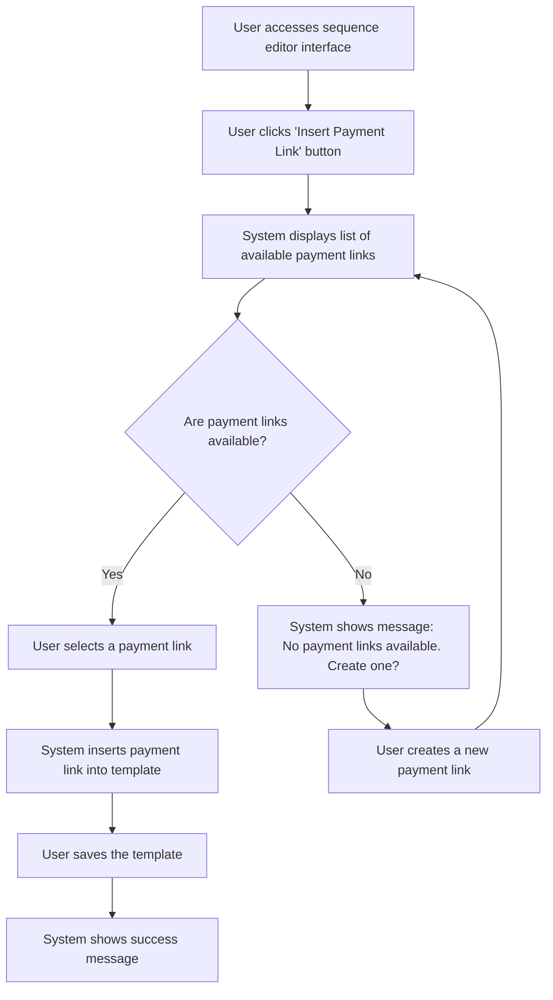

# US002 - Utiliser un Lien de Paiement dans un Email

## Description
En tant qu'utilisateur, je veux utiliser un lien de paiement dans mes templates d'emails.

## Préconditions
- L'utilisateur est connecté.
- Un lien de paiement existe.
- Un template d'email existe.

## Scénario Principal
1. L'utilisateur accède à l'interface editor de la séquence.
2. L'utilisateur clique sur un bouton pour insérer un lien de paiement.
3. Le système affiche une liste des liens de paiement disponibles.
4. L'utilisateur sélectionne un lien de paiement.
5. Le système insère le lien de paiement dans le template.
6. L'utilisateur enregistre le template.
7. Le système affiche un message de succès.

## Notes
- Il est aussi possible de créer un lien de paiement depuis l'interface editor de la séquence.

## Scénario Alternatif
- **Lien Non Disponible** : Si aucun lien de paiement n'est disponible, le système affiche un message d'information et demande à l'utilisateur d'en créer un.

## Postconditions
- Le lien de paiement est inséré dans le template d'email.
- Le template est prêt pour l'envoi.

## Notes
- Les liens de paiement doivent être insérables dans les templates d'emails.
- Les liens de paiement doivent être validés avant d'être insérés.

## User Flow Diagram


## Wireframes

### Écran Sequence Editor Interface
```
+-----------------------------------------------------+
| Modifier la Séquence                                |
+-----------------------------------------------------+
|                                                     |
| Modifier les templates d'emails et configurer les   |
| délais                                              |
|                                                     |
| Canvas: Zone de glisser-déposer pour les templates  |
| d'emails et les nœuds filtres                       |
|                                                     |
| Barre latérale: Liste des templates d'emails et des |
| nœuds filtres disponibles                           |
|                                                     |
| [Insérer un Lien de Paiement] [Sauvegarder] [Annuler] |
|                                                     |
+-----------------------------------------------------+
```

### Écran Insert Payment Link
```
+-----------------------------------------------------+
| Insérer un Lien de Paiement                          |
+-----------------------------------------------------+
|                                                     |
| Sélectionnez un lien de paiement à insérer dans le  |
| template                                             |
|                                                     |
| ( ) Lien de Paiement 1                               |
| ( ) Lien de Paiement 2                               |
| ( ) Lien de Paiement 3                               |
|                                                     |
| [Copier le Lien] [Annuler]                           |
|                                                     |
+-----------------------------------------------------+
```

### Écran No Payment Links Available
```
+-----------------------------------------------------+
| Aucun Lien de Paiement Disponible                    |
+-----------------------------------------------------+
|                                                     |
| Il n'y a aucun lien de paiement disponible          |
|                                                     |
| Souhaitez-vous créer un nouveau lien de paiement ?   |
|                                                     |
| [Créer un Lien de Paiement] [Annuler]                |
|                                                     |
+-----------------------------------------------------+
```

