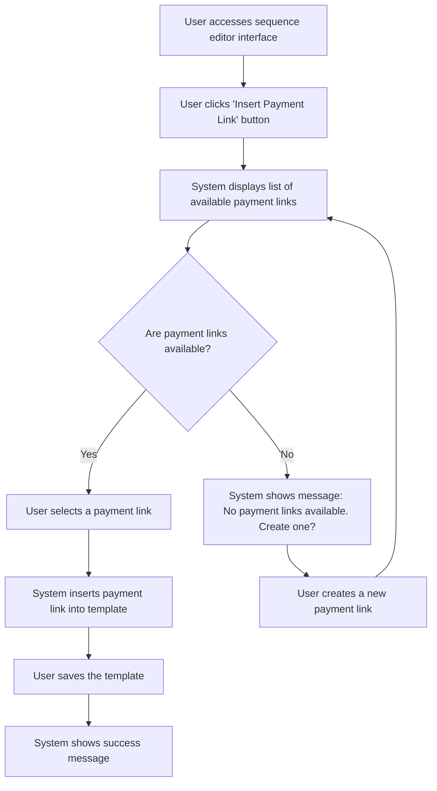

# Design: Use Payment Link in Email

## Technical Approach
The use payment link in email feature will allow users to insert a payment link into their email templates. The system will provide a list of available payment links, allow the user to select one, and insert it into the email template. The frontend will use Alpine.js for reactivity and state management, while the backend will handle data retrieval via Flask.

## Architecture Decisions

### Decision: Use Alpine.js for Frontend Reactivity
- **Description**: Alpine.js will manage the state and reactivity of the payment link insertion process.
- **Rationale**: Alpine.js is lightweight and integrates seamlessly with HTML, making it ideal for this use case.
- **Impact**: Simplifies frontend logic and improves user experience.

### Decision: Use Flask for Backend Processing
- **Description**: Flask will handle the retrieval of payment links from the `PaymentLinks` class.
- **Rationale**: Flask is lightweight and well-suited for handling HTTP requests and integrating with Parse.
- **Impact**: Ensures robust backend processing and easy integration with the database.

### Decision: Provide List of Payment Links
- **Description**: The system will display a list of available payment links for the user to select from.
- **Rationale**: A list of payment links ensures that users can easily find and select the appropriate link.
- **Impact**: Improves user experience by providing a clear and organized view of available payment links.

### Decision: Insert Payment Link into Template
- **Description**: The system will insert the selected payment link into the email template.
- **Rationale**: Inserting the payment link directly into the template simplifies the process for the user.
- **Impact**: Enhances usability by reducing the steps required to include a payment link in an email.

## Data Flow


## Data Mapping

### Parse Class: `PaymentLinks`
- **Fields**:
  - `baseUrl`: String (base URL for the payment link).
  - `dynamicVariables`: Array (list of dynamic variables used in the payment link).
  - `createdAt`: DateTime (timestamp of when the payment link was created).

### Parse Class: `Sequences`
- **Fields**:
  - `nom`: String (sequence name).
  - `templates`: Array (list of email templates in the sequence).

### Alpine.js Store: `paymentLinkUsage`
- **Fields**:
  - `availablePaymentLinks`: Array (list of available payment links).
  - `selectedPaymentLink`: Object (selected payment link for insertion).
  - `errorMessage`: String (error message to display).
  - `successMessage`: String (success message to display).

### Data Flow
1. **Input Data**:
   - The user clicks the 'Insert Payment Link' button in the sequence editor interface.
   - The system retrieves the list of available payment links from the `PaymentLinks` class.

2. **Selection**:
   - The system displays the list of available payment links.
   - If no payment links are available, the system prompts the user to create one.

3. **Insertion**:
   - The user selects a payment link from the list.
   - The system inserts the selected payment link into the email template.

4. **Saving**:
   - The user saves the email template with the inserted payment link.
   - The system saves the template to the `Sequences` class in Parse.

5. **Success Handling**:
   - If the template is saved successfully, the system displays a success message.

## Screen ASCII

### Screen 1: Sequence Editor Interface
```
┌───────────────────────────────────────────────────────────────────────────────┐
│                                                                           │
│                                                                               │
│  Edit Sequence                                                                │
│  Edit email templates and configure delays                                   │
│                                                                               │
│  Canvas: Drag-and-drop area for email templates and filter nodes            │
│                                                                               │
│  Sidebar: List of available email templates and filter nodes                 │
│                                                                               │
│  [Insert Payment Link]  [Save]  [Cancel]                                     │
│                                                                               │
│                                                                           │
└───────────────────────────────────────────────────────────────────────────────┘
```

### Screen 2: Insert Payment Link
```
┌───────────────────────────────────────────────────────────────────────────────┐
│                                                                           │
│                                                                               │
│  Insert Payment Link                                                          │
│  Select a payment link to insert into the template                            │
│                                                                               │
│  ( ) Payment Link 1                                                           │
│  ( ) Payment Link 2                                                           │
│  ( ) Payment Link 3                                                           │
│                                                                               │
│  [Copy Link]  [Cancel]                                                       │
│                                                                               │
│                                                                           │
└───────────────────────────────────────────────────────────────────────────────┘
```

### Screen 3: No Payment Links Available
```
┌───────────────────────────────────────────────────────────────────────────────┐
│                                                                           │
│                                                                               │
│  No Payment Links Available                                                   │
│  There are no payment links available                                        │
│                                                                               │
│  Would you like to create a new payment link?                                │
│                                                                               │
│  [Create Payment Link]  [Cancel]                                              │
│                                                                               │
│                                                                           │
└───────────────────────────────────────────────────────────────────────────────┘
```

## Components and Layouts

### Components/Partials Usage

#### Sequence Editor Component
- **File**: `/templates/partials/sequence_editor_component.html`
- **Role**: Handles the editing of a sequence, including inserting payment links into email templates.
- **Dependencies**:
  - `paymentLinkUsage` store for managing state.
  - `axiosParse` for API calls to Parse.

#### Insert Payment Link Component
- **File**: `/templates/partials/insert_payment_link_component.html`
- **Role**: Displays the list of available payment links and allows the user to select one for insertion.
- **Dependencies**:
  - `paymentLinkUsage` store for managing state.

#### No Payment Links Available Component
- **File**: `/templates/partials/no_payment_links_available_component.html`
- **Role**: Displays a message when no payment links are available and provides an option to create a new one.
- **Dependencies**:
  - `paymentLinkUsage` store for managing state.

#### Success Message Component
- **File**: `/templates/partials/success_message_component.html`
- **Role**: Displays a success message after a payment link is inserted into the template.
- **Dependencies**:
  - `paymentLinkUsage` store for managing state.

### Layouts

#### Base Layout
- **File**: `/templates/layouts/base_layout.html`
- **Role**: Provides the basic structure for all pages, including the header, footer, and main content area.

#### Dashboard Layout
- **File**: `/templates/layouts/dashboard_layout.html`
- **Role**: Provides the structure for dashboard pages, including the header, sidebar, and main content area.
- **Components Used**:
  - `sidebarComponent`

## Data Parse Changes

### Class: `PaymentLinks`
- **Changes**: No changes required.

### Class: `Sequences`
- **Changes**: No changes required.

## File Changes

### New Files
- `/templates/partials/sequence_editor_component.html`: Component for editing sequences.
- `/templates/partials/insert_payment_link_component.html`: Component for inserting payment links into email templates.
- `/templates/partials/no_payment_links_available_component.html`: Component for displaying messages when no payment links are available.
- `/templates/partials/success_message_component.html`: Component for displaying success messages.
- `/static/js/stores/paymentLinkUsageStore.js`: Alpine.js store for managing payment link usage state.

### Modified Files
- `/templates/layouts/base_layout.html`: Include the sequence editor component.
- `/templates/layouts/dashboard_layout.html`: Include the insert payment link component.

## Verification
Ensure the output file is created in the correct folder with the specified structure.