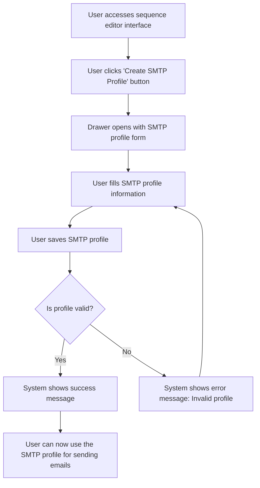

# US001 - Créer un Profil SMTP

## Description
En tant qu'utilisateur, je veux créer un profil SMTP pour configurer l'envoi des emails.

## Préconditions
- L'utilisateur est connecté.
- L'utilisateur a accès à la page de gestion des profils SMTP.

## Scénario Principal
1. L'utilisateur accède à l'interface editor de la séquence.
2. L'utilisateur clique sur un bouton pour créer un profil SMTP.
3. Un drawer s'ouvre avec un formulaire pour créer le profil SMTP.
4. L'utilisateur remplit les informations du profil SMTP :
   - Nom du profil
   - Serveur SMTP
   - Port
   - Nom d'utilisateur
   - Mot de passe (chiffré)
   - Signature HTML
5. L'utilisateur enregistre le profil SMTP.
6. Le système affiche un message de succès.

## Notes
- Il est aussi possible de créer un profil SMTP depuis l'interface editor de la séquence en cliquant sur un bouton qui ouvre un drawer avec l'include de ce composant.

## Scénario Alternatif
- **Profil Invalide** : Si le profil SMTP est invalide, le système affiche un message d'erreur et demande à l'utilisateur de le corriger.

## Postconditions
- Le profil SMTP est créé et enregistré dans la base de données.
- Le profil SMTP est disponible pour une utilisation dans l'envoi des emails.

## Notes
- Les mots de passe doivent être chiffrés.
- Les profils SMTP doivent être validés avant d'être enregistrés.

## User Flow Diagram


## Wireframes

### Écran Sequence Editor Interface
```
+-----------------------------------------------------+
| Modifier la Séquence                                |
+-----------------------------------------------------+
|                                                     |
| Modifier les templates d'emails et configurer les   |
| délais                                              |
|                                                     |
| Canvas: Zone de glisser-déposer pour les templates  |
| d'emails et les nœuds filtres                       |
|                                                     |
| Barre latérale: Liste des templates d'emails et des |
| nœuds filtres disponibles                           |
|                                                     |
| [Créer un Profil SMTP] [Sauvegarder] [Annuler]       |
|                                                     |
+-----------------------------------------------------+
```

### Écran Create SMTP Profile Drawer
```
+-----------------------------------------------------+
| Créer un Profil SMTP                                |
+-----------------------------------------------------+
|                                                     |
| Remplissez les détails du profil SMTP               |
|                                                     |
| Nom du profil : [_______________________________]   |
| Serveur SMTP : [_______________________________]   |
| Port : [____]                                       |
| Nom d'utilisateur : [_________________________]    |
| Mot de passe : [_______________________________]    |
| Signature HTML : [_____________________________]    |
|                                                     |
| [Sauvegarder le Profil] [Annuler]                   |
|                                                     |
+-----------------------------------------------------+
```

### Écran Success Message
```
+-----------------------------------------------------+
| Profil SMTP Créé                                    |
+-----------------------------------------------------+
|                                                     |
| Votre profil SMTP a été créé avec succès            |
|                                                     |
| Le profil SMTP a été enregistré.                    |
|                                                     |
| [Utiliser le Profil] [Fermer]                       |
|                                                     |
+-----------------------------------------------------+
```

### Écran Error Message
```
+-----------------------------------------------------+
| Erreur                                               |
+-----------------------------------------------------+
|                                                     |
| Une erreur est survenue lors de la création du      |
| profil SMTP                                         |
|                                                     |
| Veuillez vous assurer que tous les champs sont      |
| remplis correctement.                               |
|                                                     |
| [Réessayer] [Annuler]                                |
|                                                     |
+-----------------------------------------------------+
```