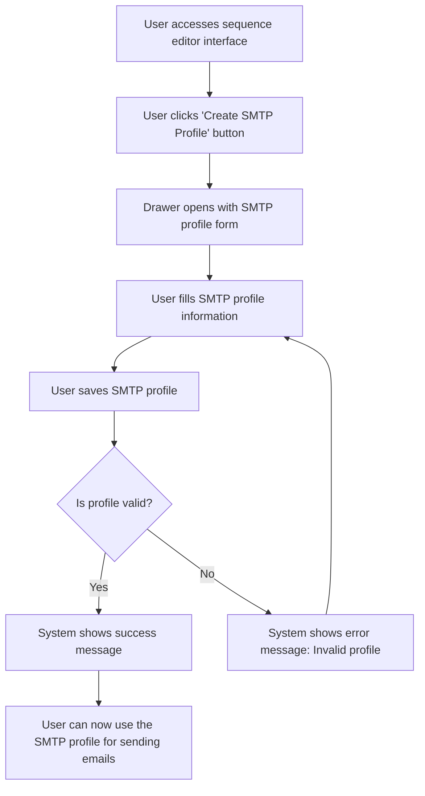

# Design: Create SMTP Profile

## Technical Approach
The create SMTP profile feature will allow users to create an SMTP profile for configuring email sending. The system will provide a drawer with a form to input the SMTP profile details, including server information, port, username, encrypted password, and HTML signature. The frontend will use Alpine.js for reactivity and state management, while the backend will handle data storage via Flask.

## Architecture Decisions

### Decision: Use Alpine.js for Frontend Reactivity
- **Description**: Alpine.js will manage the state and reactivity of the SMTP profile creation process.
- **Rationale**: Alpine.js is lightweight and integrates seamlessly with HTML, making it ideal for this use case.
- **Impact**: Simplifies frontend logic and improves user experience.

### Decision: Use Flask for Backend Processing
- **Description**: Flask will handle the SMTP profile creation and data storage operations.
- **Rationale**: Flask is lightweight and well-suited for handling HTTP requests and integrating with Parse.
- **Impact**: Ensures robust backend processing and easy integration with the database.

### Decision: Use Drawer for Form Display
- **Description**: The SMTP profile form will be displayed in a drawer that slides out from the side of the screen.
- **Rationale**: A drawer provides a non-intrusive way to display the form while keeping the main interface visible.
- **Impact**: Improves user experience by allowing easy access to the form without losing context.

### Decision: Encrypt Passwords
- **Description**: Passwords will be encrypted before being stored in the database.
- **Rationale**: Encryption ensures that passwords are secure and protected.
- **Impact**: Enhances security and protects sensitive user data.

### Decision: Validate SMTP Profiles
- **Description**: The system will validate SMTP profiles before saving them to ensure they are correctly formatted.
- **Rationale**: Validation ensures that SMTP profiles are functional and reduces errors.
- **Impact**: Improves data quality and user experience.

## Data Flow


## Data Mapping

### Parse Class: `SMTPProfiles`
- **Fields**:
  - `nom`: String (profile name).
  - `serveur`: String (SMTP server address).
  - `port`: Number (SMTP server port).
  - `utilisateur`: String (SMTP username).
  - `motDePasse`: String (encrypted SMTP password).
  - `signatureHTML`: String (HTML signature for emails).
  - `createdAt`: DateTime (timestamp of when the profile was created).
  - `updatedAt`: DateTime (timestamp of when the profile was last updated).

### Alpine.js Store: `smtpProfileCreation`
- **Fields**:
  - `profileName`: String (name of the SMTP profile).
  - `smtpServer`: String (SMTP server address).
  - `smtpPort`: Number (SMTP server port).
  - `username`: String (SMTP username).
  - `password`: String (SMTP password).
  - `htmlSignature`: String (HTML signature for emails).
  - `isDrawerOpen`: Boolean (indicates if the drawer is open).
  - `errorMessage`: String (error message to display).
  - `successMessage`: String (success message to display).

### Data Flow
1. **Input Data**:
   - The user clicks the 'Create SMTP Profile' button in the sequence editor interface.
   - The system opens a drawer with a form to input the SMTP profile details.

2. **Form Submission**:
   - The user fills in the profile name, SMTP server, port, username, password, and HTML signature.
   - The user submits the form to save the SMTP profile.

3. **Validation**:
   - The system validates that the SMTP profile is correctly formatted and includes all required fields.
   - If the profile is invalid, the system displays an error message and prompts the user to correct it.

4. **Saving**:
   - The system encrypts the password and saves the SMTP profile details to the `SMTPProfiles` class in Parse.
   - The system displays a success message upon successful saving.

5. **Usage**:
   - The user can now use the SMTP profile for sending emails.

## Screen ASCII

### Screen 1: Sequence Editor Interface
```
┌───────────────────────────────────────────────────────────────────────────────┐
│                                                                           │
│                                                                               │
│  Edit Sequence                                                                │
│  Edit email templates and configure delays                                   │
│                                                                               │
│  Canvas: Drag-and-drop area for email templates and filter nodes            │
│                                                                               │
│  Sidebar: List of available email templates and filter nodes                 │
│                                                                               │
│  [Create SMTP Profile]  [Save]  [Cancel]                                     │
│                                                                               │
│                                                                           │
└───────────────────────────────────────────────────────────────────────────────┘
```

### Screen 2: Create SMTP Profile Drawer
```
┌───────────────────────────────────────────────────────────────────────────────┐
│                                                                           │
│                                                                               │
│  Create SMTP Profile                                                         │
│  Fill in the SMTP profile details                                            │
│                                                                               │
│  Profile Name: [________________________________________________________]      │
│  SMTP Server: [________________________________________________________]       │
│  Port: [____]                                                                 │
│  Username: [________________________________________________________]         │
│  Password: [________________________________________________________]            │
│  HTML Signature: [_________________________________________________]           │
│                                                                               │
│  [Save Profile]  [Cancel]                                                     │
│                                                                               │
│                                                                           │
└───────────────────────────────────────────────────────────────────────────────┘
```

### Screen 3: Success Message
```
┌───────────────────────────────────────────────────────────────────────────────┐
│                                                                           │
│                                                                               │
│  SMTP Profile Created                                                        │
│  Your SMTP profile has been created successfully                              │
│                                                                               │
│  The SMTP profile has been saved.                                            │
│                                                                               │
│  [Use Profile]  [Close]                                                      │
│                                                                               │
│                                                                           │
└───────────────────────────────────────────────────────────────────────────────┘
```

### Screen 4: Error Message
```
┌───────────────────────────────────────────────────────────────────────────────┐
│                                                                           │
│                                                                               │
│  Error                                                                        │
│  An error occurred while creating the SMTP profile                           │
│                                                                               │
│  Please ensure all fields are filled correctly.                              │
│                                                                               │
│  [Retry]  [Cancel]                                                            │
│                                                                               │
│                                                                           │
└───────────────────────────────────────────────────────────────────────────────┘
```

## Components and Layouts

### Components/Partials Usage

#### Sequence Editor Component
- **File**: `/templates/partials/sequence_editor_component.html`
- **Role**: Handles the editing of a sequence, including accessing the SMTP profile creation drawer.
- **Dependencies**:
  - `smtpProfileCreation` store for managing state.
  - `axiosParse` for API calls to Parse.

#### Create SMTP Profile Drawer Component
- **File**: `/templates/partials/create_smtp_profile_drawer_component.html`
- **Role**: Displays the form for creating an SMTP profile in a drawer.
- **Dependencies**:
  - `smtpProfileCreation` store for managing state.

#### Success Message Component
- **File**: `/templates/partials/success_message_component.html`
- **Role**: Displays a success message after an SMTP profile is created.
- **Dependencies**:
  - `smtpProfileCreation` store for managing state.

#### Error Message Component
- **File**: `/templates/partials/error_message_component.html`
- **Role**: Displays error messages during the SMTP profile creation process.
- **Dependencies**:
  - `smtpProfileCreation` store for managing state.

### Layouts

#### Base Layout
- **File**: `/templates/layouts/base_layout.html`
- **Role**: Provides the basic structure for all pages, including the header, footer, and main content area.

#### Dashboard Layout
- **File**: `/templates/layouts/dashboard_layout.html`
- **Role**: Provides the structure for dashboard pages, including the header, sidebar, and main content area.
- **Components Used**:
  - `sidebarComponent`

## Data Parse Changes

### Class: `SMTPProfiles`
- **New Class**:
  - `SMTPProfiles` will store SMTP profile information, including profile name, server details, port, username, encrypted password, HTML signature, and timestamps.

## File Changes

### New Files
- `/templates/partials/sequence_editor_component.html`: Component for editing sequences.
- `/templates/partials/create_smtp_profile_drawer_component.html`: Component for creating SMTP profiles.
- `/templates/partials/success_message_component.html`: Component for displaying success messages.
- `/templates/partials/error_message_component.html`: Component for displaying error messages.
- `/static/js/stores/smtpProfileCreationStore.js`: Alpine.js store for managing SMTP profile creation state.

### Modified Files
- `/templates/layouts/base_layout.html`: Include the sequence editor component.
- `/templates/layouts/dashboard_layout.html`: Include the create SMTP profile drawer component.

## Verification
Ensure the output file is created in the correct folder with the specified structure.