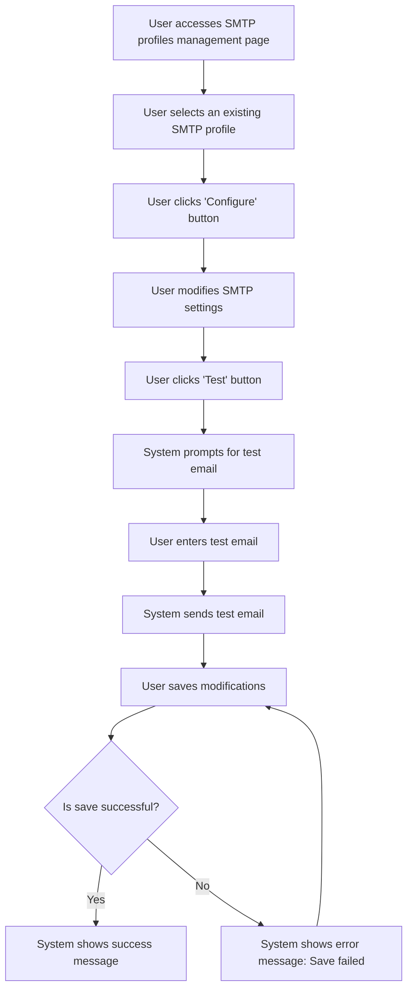

# Design: Configure SMTP Profile

## Technical Approach
The configure SMTP profile feature will allow users to configure the SMTP settings for an existing profile. The system will provide a form to modify the SMTP server, port, username, encrypted password, and HTML signature. Users can also send a test email to verify the configuration. The frontend will use Alpine.js for reactivity and state management, while the backend will handle data storage and email sending via Flask.

## Architecture Decisions

### Decision: Use Alpine.js for Frontend Reactivity
- **Description**: Alpine.js will manage the state and reactivity of the SMTP profile configuration process.
- **Rationale**: Alpine.js is lightweight and integrates seamlessly with HTML, making it ideal for this use case.
- **Impact**: Simplifies frontend logic and improves user experience.

### Decision: Use Flask for Backend Processing
- **Description**: Flask will handle the SMTP profile configuration and email sending operations.
- **Rationale**: Flask is lightweight and well-suited for handling HTTP requests and integrating with Parse.
- **Impact**: Ensures robust backend processing and easy integration with the database.

### Decision: Provide Test Email Functionality
- **Description**: The system will allow users to send a test email to verify the SMTP configuration.
- **Rationale**: Test email functionality ensures that the SMTP settings are correct and functional.
- **Impact**: Improves user experience by providing immediate feedback on the configuration.

### Decision: Encrypt Passwords
- **Description**: Passwords will be encrypted before being stored in the database.
- **Rationale**: Encryption ensures that passwords are secure and protected.
- **Impact**: Enhances security and protects sensitive user data.

### Decision: Validate SMTP Profiles
- **Description**: The system will validate SMTP profiles before saving them to ensure they are correctly formatted.
- **Rationale**: Validation ensures that SMTP profiles are functional and reduces errors.
- **Impact**: Improves data quality and user experience.

## Data Flow


## Data Mapping

### Parse Class: `SMTPProfiles`
- **Fields**:
  - `nom`: String (profile name).
  - `serveur`: String (SMTP server address).
  - `port`: Number (SMTP server port).
  - `utilisateur`: String (SMTP username).
  - `motDePasse`: String (encrypted SMTP password).
  - `signatureHTML`: String (HTML signature for emails).
  - `createdAt`: DateTime (timestamp of when the profile was created).
  - `updatedAt`: DateTime (timestamp of when the profile was last updated).

### Alpine.js Store: `smtpProfileConfiguration`
- **Fields**:
  - `profileId`: String (ID of the SMTP profile being configured).
  - `profileName`: String (name of the SMTP profile).
  - `smtpServer`: String (SMTP server address).
  - `smtpPort`: Number (SMTP server port).
  - `username`: String (SMTP username).
  - `password`: String (SMTP password).
  - `htmlSignature`: String (HTML signature for emails).
  - `testEmail`: String (email address for test email).
  - `errorMessage`: String (error message to display).
  - `successMessage`: String (success message to display).

### Data Flow
1. **Input Data**:
   - The user selects an existing SMTP profile from the `SMTPProfiles` class.
   - The system retrieves the profile details and displays them in the configuration form.

2. **Modification**:
   - The user modifies the SMTP server, port, username, password, and HTML signature.

3. **Testing**:
   - The user clicks the 'Test' button to send a test email.
   - The system prompts the user to enter an email address for the test email.
   - The system sends a test email to the specified address.

4. **Saving**:
   - The user saves the modifications to the SMTP profile.
   - The system encrypts the password and saves the profile details to the `SMTPProfiles` class in Parse.

5. **Success Handling**:
   - If the profile is saved successfully, the system displays a success message.

6. **Error Handling**:
   - If the profile cannot be saved, the system displays an error message and prompts the user to retry.

## Screen ASCII

### Screen 1: SMTP Profiles Management Page
```
┌───────────────────────────────────────────────────────────────────────────────┐
│                                                                           │
│                                                                               │
│  SMTP Profiles Management                                                     │
│  Manage your SMTP profiles                                                   │
│                                                                               │
│  ┌─────────────────────────────────────────────────────────────────────────┐  │
│  │  Name  │  Server  │  Port  │  Username  │  Actions                          │  │
│  ├─────────────────────────────────────────────────────────────────────────┤  │
│  │  Profile 1  │  smtp.example.com  │  587  │  user1  │  [Configure] [Delete]      │  │
│  │  Profile 2  │  smtp.example.com  │  465  │  user2  │  [Configure] [Delete]      │  │
│  └─────────────────────────────────────────────────────────────────────────┘  │
│                                                                               │
│  [Create New Profile]  [Previous]  [1]  [2]  [3]  [Next]                     │
│                                                                               │
│                                                                           │
└───────────────────────────────────────────────────────────────────────────────┘
```

### Screen 2: Configure SMTP Profile
```
┌───────────────────────────────────────────────────────────────────────────────┐
│                                                                           │
│                                                                               │
│  Configure SMTP Profile                                                       │
│  Modify the SMTP profile settings                                              │
│                                                                               │
│  Profile Name: [________________________________________________________]      │
│  SMTP Server: [________________________________________________________]       │
│  Port: [____]                                                                 │
│  Username: [________________________________________________________]         │
│  Password: [________________________________________________________]            │
│  HTML Signature: [_________________________________________________]           │
│                                                                               │
│  [Test]  [Save]  [Cancel]                                                     │
│                                                                               │
│                                                                           │
└───────────────────────────────────────────────────────────────────────────────┘
```

### Screen 3: Test Email Prompt
```
┌───────────────────────────────────────────────────────────────────────────────┐
│                                                                           │
│                                                                               │
│  Send Test Email                                                               │
│  Enter an email address to send a test email                                   │
│                                                                               │
│  Email: [_________________________________________________________________]     │
│                                                                               │
│  [Send Test Email]  [Cancel]                                                  │
│                                                                               │
│                                                                           │
└───────────────────────────────────────────────────────────────────────────────┘
```

### Screen 4: Success Message
```
┌───────────────────────────────────────────────────────────────────────────────┐
│                                                                           │
│                                                                               │
│  SMTP Profile Configured                                                      │
│  Your SMTP profile has been configured successfully                           │
│                                                                               │
│  The SMTP profile has been saved.                                              │
│                                                                               │
│  [Use Profile]  [Close]                                                        │
│                                                                               │
│                                                                           │
└───────────────────────────────────────────────────────────────────────────────┘
```

### Screen 5: Error Message
```
┌───────────────────────────────────────────────────────────────────────────────┐
│                                                                           │
│                                                                               │
│  Error                                                                        │
│  An error occurred while saving the SMTP profile                             │
│                                                                               │
│  Please ensure all fields are filled correctly.                              │
│                                                                               │
│  [Retry]  [Cancel]                                                            │
│                                                                               │
│                                                                           │
└───────────────────────────────────────────────────────────────────────────────┘
```

## Components and Layouts

### Components/Partials Usage

#### SMTP Profiles Management Component
- **File**: `/templates/partials/smtp_profiles_management_component.html`
- **Role**: Displays the list of SMTP profiles and provides options to configure and delete profiles.
- **Dependencies**:
  - `smtpProfileConfiguration` store for managing state.
  - `axiosParse` for API calls to Parse.

#### Configure SMTP Profile Component
- **File**: `/templates/partials/configure_smtp_profile_component.html`
- **Role**: Handles the configuration of an SMTP profile, including sending test emails.
- **Dependencies**:
  - `smtpProfileConfiguration` store for managing state.

#### Test Email Prompt Component
- **File**: `/templates/partials/test_email_prompt_component.html`
- **Role**: Prompts the user to enter an email address for sending a test email.
- **Dependencies**:
  - `smtpProfileConfiguration` store for managing state.

#### Success Message Component
- **File**: `/templates/partials/success_message_component.html`
- **Role**: Displays a success message after an SMTP profile is configured.
- **Dependencies**:
  - `smtpProfileConfiguration` store for managing state.

#### Error Message Component
- **File**: `/templates/partials/error_message_component.html`
- **Role**: Displays error messages during the SMTP profile configuration process.
- **Dependencies**:
  - `smtpProfileConfiguration` store for managing state.

### Layouts

#### Base Layout
- **File**: `/templates/layouts/base_layout.html`
- **Role**: Provides the basic structure for all pages, including the header, footer, and main content area.

#### Dashboard Layout
- **File**: `/templates/layouts/dashboard_layout.html`
- **Role**: Provides the structure for dashboard pages, including the header, sidebar, and main content area.
- **Components Used**:
  - `sidebarComponent`

## Data Parse Changes

### Class: `SMTPProfiles`
- **Changes**: No changes required.

## File Changes

### New Files
- `/templates/partials/smtp_profiles_management_component.html`: Component for managing SMTP profiles.
- `/templates/partials/configure_smtp_profile_component.html`: Component for configuring SMTP profiles.
- `/templates/partials/test_email_prompt_component.html`: Component for prompting test email addresses.
- `/templates/partials/success_message_component.html`: Component for displaying success messages.
- `/templates/partials/error_message_component.html`: Component for displaying error messages.
- `/static/js/stores/smtpProfileConfigurationStore.js`: Alpine.js store for managing SMTP profile configuration state.

### Modified Files
- `/templates/layouts/base_layout.html`: Include the SMTP profiles management component.
- `/templates/layouts/dashboard_layout.html`: Include the configure SMTP profile component.

## Verification
Ensure the output file is created in the correct folder with the specified structure.