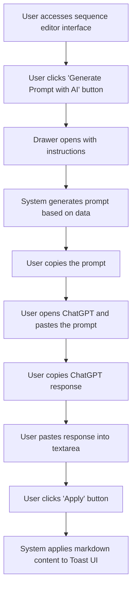

# Design: Generate Prompt for ChatGPT

## Technical Approach
The generate prompt for ChatGPT feature will allow users to generate a prompt for ChatGPT based on their data directly from the sequence editor interface. The system will provide a drawer with instructions to copy the prompt, open ChatGPT, paste the response, and apply the markdown content to Toast UI. The frontend will use Alpine.js for reactivity and state management, while the backend will handle data retrieval and prompt generation via Flask.

## Architecture Decisions

### Decision: Use Alpine.js for Frontend Reactivity
- **Description**: Alpine.js will manage the state and reactivity of the prompt generation process.
- **Rationale**: Alpine.js is lightweight and integrates seamlessly with HTML, making it ideal for this use case.
- **Impact**: Simplifies frontend logic and improves user experience.

### Decision: Use Flask for Backend Processing
- **Description**: Flask will handle the prompt generation and data retrieval operations.
- **Rationale**: Flask is lightweight and well-suited for handling HTTP requests and integrating with Parse.
- **Impact**: Ensures robust backend processing and easy integration with the database.

### Decision: Use Drawer for Instructions
- **Description**: The instructions for generating and using the prompt will be displayed in a drawer.
- **Rationale**: A drawer provides a non-intrusive way to display instructions while keeping the main interface visible.
- **Impact**: Improves user experience by allowing easy access to instructions without losing context.

### Decision: Generate Prompt Based on Data
- **Description**: The system will generate a prompt based on the application data and available variables.
- **Rationale**: Data-based prompts ensure that the generated content is relevant and useful.
- **Impact**: Enhances the effectiveness of the prompts generated.

### Decision: Force Markdown Response
- **Description**: The prompt will force a response from ChatGPT in markdown format.
- **Rationale**: Markdown format ensures that the response can be easily applied to Toast UI.
- **Impact**: Improves the usability of the generated content.

## Data Flow


## Data Mapping

### Parse Class: `Sequences`
- **Fields**:
  - `nom`: String (sequence name).
  - `templates`: Array (list of email templates in the sequence).

### Alpine.js Store: `promptGeneration`
- **Fields**:
  - `generatedPrompt`: String (generated prompt for ChatGPT).
  - `chatGptResponse`: String (response from ChatGPT).
  - `isDrawerOpen`: Boolean (indicates if the drawer is open).
  - `errorMessage`: String (error message to display).
  - `successMessage`: String (success message to display).

### Data Flow
1. **Input Data**:
   - The user clicks the 'Generate Prompt with AI' button in the sequence editor interface.
   - The system retrieves the necessary data from the `Sequences` class and generates a prompt.

2. **Prompt Generation**:
   - The system generates a prompt based on the application data and available variables.
   - The prompt is displayed in the drawer along with instructions.

3. **User Interaction**:
   - The user copies the prompt and opens ChatGPT.
   - The user pastes the prompt into ChatGPT and copies the response.
   - The user pastes the response into the provided textarea in the drawer.

4. **Application**:
   - The user clicks the 'Apply' button to apply the markdown content to Toast UI.
   - The system processes the markdown content and applies it to the email template.

5. **Success Handling**:
   - If the content is applied successfully, the system displays a success message.

## Screen ASCII

### Screen 1: Sequence Editor Interface
```
┌───────────────────────────────────────────────────────────────────────────────┐
│                                                                           │
│                                                                               │
│  Edit Sequence                                                                │
│  Edit email templates and configure delays                                   │
│                                                                               │
│  Canvas: Drag-and-drop area for email templates and filter nodes            │
│                                                                               │
│  Sidebar: List of available email templates and filter nodes                 │
│                                                                               │
│  [Generate Prompt with AI]  [Save]  [Cancel]                                 │
│                                                                               │
│                                                                           │
└───────────────────────────────────────────────────────────────────────────────┘
```

### Screen 2: Generate Prompt Drawer
```
┌───────────────────────────────────────────────────────────────────────────────┐
│                                                                           │
│                                                                               │
│  Generate Prompt for ChatGPT                                                  │
│  Instructions:                                                               │
│  1. Click 'Copy Prompt' to copy the generated prompt.                        │
│  2. Open ChatGPT by clicking 'Open ChatGPT'.                                 │
│  3. Paste the prompt into ChatGPT and get the response.                      │
│  4. Copy the response from ChatGPT and paste it into the space below.        │
│  5. Click 'Apply' to apply the content.                                       │
│                                                                               │
│  [Copy Prompt]  [Open ChatGPT]                                                │
│                                                                               │
│  ChatGPT Response:                                                           │
│  [_________________________________________________________________]          │
│  [_________________________________________________________________]          │
│  [_________________________________________________________________]          │
│                                                                               │
│  [Apply]  [Cancel]                                                            │
│                                                                               │
│                                                                           │
└───────────────────────────────────────────────────────────────────────────────┘
```

## Components and Layouts

### Components/Partials Usage

#### Sequence Editor Component
- **File**: `/templates/partials/sequence_editor_component.html`
- **Role**: Handles the editing of a sequence, including generating prompts for ChatGPT.
- **Dependencies**:
  - `promptGeneration` store for managing state.
  - `axiosParse` for API calls to Parse.

#### Generate Prompt Drawer Component
- **File**: `/templates/partials/generate_prompt_drawer_component.html`
- **Role**: Displays the instructions and textarea for generating and applying prompts.
- **Dependencies**:
  - `promptGeneration` store for managing state.

#### Success Message Component
- **File**: `/templates/partials/success_message_component.html`
- **Role**: Displays a success message after the markdown content is applied.
- **Dependencies**:
  - `promptGeneration` store for managing state.

#### Error Message Component
- **File**: `/templates/partials/error_message_component.html`
- **Role**: Displays error messages during the prompt generation process.
- **Dependencies**:
  - `promptGeneration` store for managing state.

### Layouts

#### Base Layout
- **File**: `/templates/layouts/base_layout.html`
- **Role**: Provides the basic structure for all pages, including the header, footer, and main content area.

#### Dashboard Layout
- **File**: `/templates/layouts/dashboard_layout.html`
- **Role**: Provides the structure for dashboard pages, including the header, sidebar, and main content area.
- **Components Used**:
  - `sidebarComponent`

## Data Parse Changes

### Class: `Sequences`
- **Changes**: No changes required.

## File Changes

### New Files
- `/templates/partials/sequence_editor_component.html`: Component for editing sequences.
- `/templates/partials/generate_prompt_drawer_component.html`: Component for generating prompts for ChatGPT.
- `/templates/partials/success_message_component.html`: Component for displaying success messages.
- `/templates/partials/error_message_component.html`: Component for displaying error messages.
- `/static/js/stores/promptGenerationStore.js`: Alpine.js store for managing prompt generation state.

### Modified Files
- `/templates/layouts/base_layout.html`: Include the sequence editor component.
- `/templates/layouts/dashboard_layout.html`: Include the generate prompt drawer component.

## Verification
Ensure the output file is created in the correct folder with the specified structure.