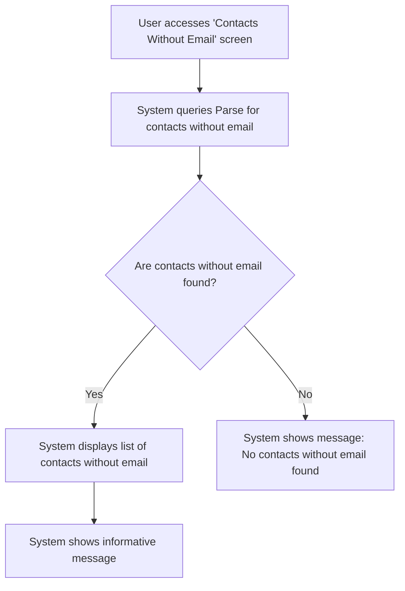

# Design: Display Contacts Without Email

## Technical Approach
The display contacts without email feature will allow users to view and manage contacts that do not have an email address. The system will retrieve contacts without emails from the `Contacts` class in Parse and display them in a clear list. The frontend will use Alpine.js for reactivity and state management, while the backend will handle data retrieval via Flask.

## Architecture Decisions

### Decision: Use Alpine.js for Frontend Reactivity
- **Description**: Alpine.js will manage the state and reactivity of the contacts display process.
- **Rationale**: Alpine.js is lightweight and integrates seamlessly with HTML, making it ideal for this use case.
- **Impact**: Simplifies frontend logic and improves user experience.

### Decision: Use Flask for Backend Processing
- **Description**: Flask will handle the retrieval of contacts without emails from the `Contacts` class.
- **Rationale**: Flask is lightweight and well-suited for handling HTTP requests and integrating with Parse.
- **Impact**: Ensures robust backend processing and easy integration with the database.

### Decision: Display Clear List of Contacts
- **Description**: The system will display a clear and simple list of contacts without emails.
- **Rationale**: A clear display ensures that users can easily identify and manage contacts without emails.
- **Impact**: Improves user experience by providing a straightforward view of the contacts.

### Decision: Provide Informative Message
- **Description**: The system will provide an informative message explaining how to update contact information in Analyse Immo.
- **Rationale**: An informative message guides users on the next steps to resolve the issue.
- **Impact**: Enhances user experience by providing clear instructions.

## Data Flow


## Data Mapping

### Parse Class: `Contacts`
- **Fields**:
  - `nom`: String (contact name).
  - `email`: String (contact email).
  - `telephone`: String (contact phone number).
  - `impayes`: Array (list of unpaid invoices associated with the contact).

### Alpine.js Store: `contactsWithoutEmail`
- **Fields**:
  - `contacts`: Array (list of contacts without email).
  - `errorMessage`: String (error message to display).
  - `infoMessage`: String (informative message to display).

### Data Flow
1. **Input Data**:
   - The user accesses the 'Contacts Without Email' screen.
   - The system queries the `Contacts` class in Parse to retrieve contacts without emails.

2. **Data Retrieval**:
   - The system retrieves the list of contacts without emails and their associated unpaid invoices.

3. **Display**:
   - If contacts without emails are found, the system displays them in a list.
   - If no contacts without emails are found, the system displays an informative message.

4. **Informative Message**:
   - The system displays a message explaining how to update contact information in Analyse Immo.

## Screen ASCII

### Screen 1: Contacts Without Email
```
┌───────────────────────────────────────────────────────────────────────────────┐
│                                                                           │
│                                                                               │
│  Contacts Without Email                                                      │
│  List of contacts without email                                              │
│                                                                               │
│  Contact Name 1 - 5 unpaid invoices - 1500€                                  │
│  Contact Name 2 - 3 unpaid invoices - 900€                                   │
│  Contact Name 3 - 2 unpaid invoices - 600€                                   │
│                                                                               │
│  Message:                                                                   │
│  "Update the information in Analyse Immo and return at the next hour."      │
│                                                                               │
│                                                                           │
└───────────────────────────────────────────────────────────────────────────────┘
```

### Screen 2: No Contacts Without Email
```
┌───────────────────────────────────────────────────────────────────────────────┐
│                                                                           │
│                                                                               │
│  No Contacts Without Email                                                  │
│  No contacts without email were found.                                       │
│                                                                               │
│  Message:                                                                   │
│  "All contacts have email addresses."                                       │
│                                                                               │
│                                                                           │
└───────────────────────────────────────────────────────────────────────────────┘
```

## Components and Layouts

### Components/Partials Usage

#### Contacts Without Email Component
- **File**: `/templates/partials/contacts_without_email_component.html`
- **Role**: Displays the list of contacts without email and the informative message.
- **Dependencies**:
  - `contactsWithoutEmail` store for managing state.
  - `axiosParse` for API calls to Parse.

#### No Contacts Without Email Component
- **File**: `/templates/partials/no_contacts_without_email_component.html`
- **Role**: Displays a message when no contacts without email are found.
- **Dependencies**:
  - `contactsWithoutEmail` store for managing state.

### Layouts

#### Base Layout
- **File**: `/templates/layouts/base_layout.html`
- **Role**: Provides the basic structure for all pages, including the header, footer, and main content area.

#### Dashboard Layout
- **File**: `/templates/layouts/dashboard_layout.html`
- **Role**: Provides the structure for dashboard pages, including the header, sidebar, and main content area.
- **Components Used**:
  - `sidebarComponent`

## Data Parse Changes

### Class: `Contacts`
- **Changes**: No changes required.

## File Changes

### New Files
- `/templates/partials/contacts_without_email_component.html`: Component for displaying contacts without email.
- `/templates/partials/no_contacts_without_email_component.html`: Component for displaying messages when no contacts without email are found.
- `/static/js/stores/contactsWithoutEmailStore.js`: Alpine.js store for managing contacts without email state.

### Modified Files
- `/templates/layouts/base_layout.html`: Include the contacts without email component.
- `/templates/layouts/dashboard_layout.html`: Include the no contacts without email component.

## Verification
Ensure the output file is created in the correct folder with the specified structure.