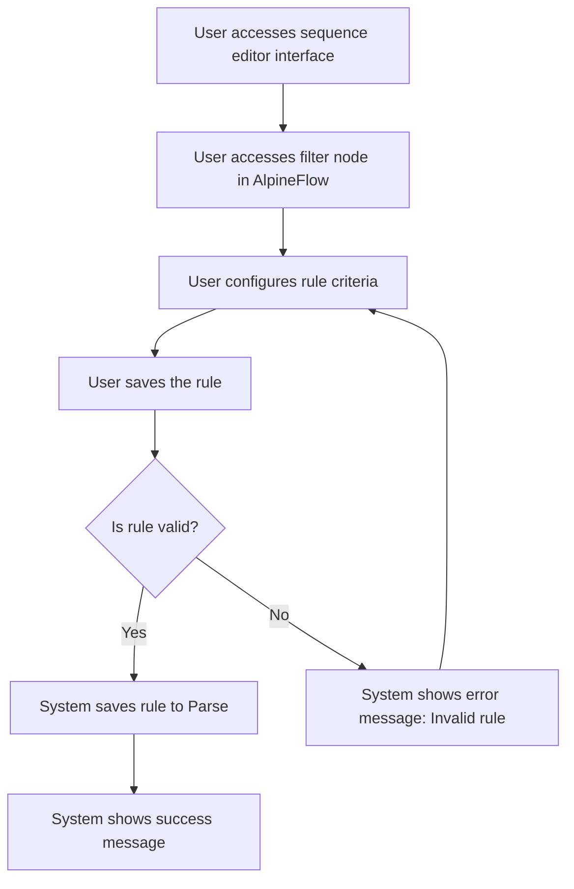

# Design: Create Automatic Assignment Rule

## Technical Approach
The create automatic assignment rule feature will allow users to create rules for automatic assignment directly from the sequence editor interface. The system will provide a form to configure rule criteria based on variables from the `config/variables.json` file, including conditions and filters. The frontend will use Alpine.js for reactivity and state management, while the backend will handle data storage via Flask.

## Architecture Decisions

### Decision: Use Alpine.js for Frontend Reactivity
- **Description**: Alpine.js will manage the state and reactivity of the rule creation process.
- **Rationale**: Alpine.js is lightweight and integrates seamlessly with HTML, making it ideal for this use case.
- **Impact**: Simplifies frontend logic and improves user experience.

### Decision: Use Flask for Backend Processing
- **Description**: Flask will handle the rule creation and data storage operations.
- **Rationale**: Flask is lightweight and well-suited for handling HTTP requests and integrating with Parse.
- **Impact**: Ensures robust backend processing and easy integration with the database.

### Decision: Use Variables from `config/variables.json`
- **Description**: The system will use variables from the `config/variables.json` file to configure rule criteria.
- **Rationale**: Using predefined variables ensures consistency and ease of configuration.
- **Impact**: Enhances the flexibility and usability of the rules.

### Decision: Validate Rules
- **Description**: The system will validate rules before saving them to ensure they are correctly formatted.
- **Rationale**: Validation ensures that rules are functional and reduces errors.
- **Impact**: Improves data quality and user experience.

## Data Flow


## Data Mapping

### Parse Class: `Sequences`
- **Fields**:
  - `nom`: String (sequence name).
  - `rules`: Array (list of automatic assignment rules).

### JSON File: `config/variables.json`
- **Fields**:
  - `variables`: Array (list of variables for rule criteria).

### Alpine.js Store: `ruleCreation`
- **Fields**:
  - `availableVariables`: Array (list of available variables from `config/variables.json`).
  - `ruleCriteria`: Array (list of rule criteria configured by the user).
  - `ruleConditions`: Array (list of conditions for the rule).
  - `errorMessage`: String (error message to display).
  - `successMessage`: String (success message to display).

### Data Flow
1. **Input Data**:
   - The user accesses the filter node in the sequence editor interface.
   - The system retrieves the list of available variables from the `config/variables.json` file.

2. **Rule Configuration**:
   - The user configures the rule criteria using the available variables and conditions.

3. **Validation**:
   - The system validates that the rule is correctly formatted and includes all required fields.
   - If the rule is invalid, the system displays an error message and prompts the user to correct it.

4. **Saving**:
   - The system saves the rule to the `Sequences` class in Parse.
   - The system displays a success message upon successful saving.

## Screen ASCII

### Screen 1: Create Assignment Rule
```
┌───────────────────────────────────────────────────────────────────────────────┐
│                                                                           │
│                                                                               │
│  Create Assignment Rule                                                       │
│  Configure the criteria for the automatic assignment rule                     │
│                                                                               │
│  Groups:                                                                     │
│  [ADD]  [OR]                                                                  │
│                                                                               │
│  Filters:                                                                   │
│  [Field]  [Operator]  [Value]                                                 │
│  Operators: contains, does not contain, starts with, does not start with,    │
│  ends with, does not end with, is, greater than, equal, less than, before    │
│  date, after date, between date 1 and date 2                                 │
│                                                                               │
│  Conditions:                                                                │
│  [Include]  [Exclude]                                                        │
│                                                                               │
│  [Save]  [Cancel]                                                           │
│                                                                               │
│                                                                           │
└───────────────────────────────────────────────────────────────────────────────┘
```

## Components and Layouts

### Components/Partials Usage

#### Sequence Editor Component
- **File**: `/templates/partials/sequence_editor_component.html`
- **Role**: Handles the editing of a sequence, including creating automatic assignment rules.
- **Dependencies**:
  - `ruleCreation` store for managing state.
  - `axiosParse` for API calls to Parse.

#### Create Assignment Rule Component
- **File**: `/templates/partials/create_assignment_rule_component.html`
- **Role**: Displays the form for creating an automatic assignment rule.
- **Dependencies**:
  - `ruleCreation` store for managing state.

#### Success Message Component
- **File**: `/templates/partials/success_message_component.html`
- **Role**: Displays a success message after a rule is created.
- **Dependencies**:
  - `ruleCreation` store for managing state.

#### Error Message Component
- **File**: `/templates/partials/error_message_component.html`
- **Role**: Displays error messages during the rule creation process.
- **Dependencies**:
  - `ruleCreation` store for managing state.

### Layouts

#### Base Layout
- **File**: `/templates/layouts/base_layout.html`
- **Role**: Provides the basic structure for all pages, including the header, footer, and main content area.

#### Dashboard Layout
- **File**: `/templates/layouts/dashboard_layout.html`
- **Role**: Provides the structure for dashboard pages, including the header, sidebar, and main content area.
- **Components Used**:
  - `sidebarComponent`

## Data Parse Changes

### Class: `Sequences`
- **New Field**:
  - `rules`: Array (list of automatic assignment rules).

## File Changes

### New Files
- `/templates/partials/sequence_editor_component.html`: Component for editing sequences.
- `/templates/partials/create_assignment_rule_component.html`: Component for creating assignment rules.
- `/templates/partials/success_message_component.html`: Component for displaying success messages.
- `/templates/partials/error_message_component.html`: Component for displaying error messages.
- `/static/js/stores/ruleCreationStore.js`: Alpine.js store for managing rule creation state.

### Modified Files
- `/templates/layouts/base_layout.html`: Include the sequence editor component.
- `/templates/layouts/dashboard_layout.html`: Include the create assignment rule component.

## Verification
Ensure the output file is created in the correct folder with the specified structure.