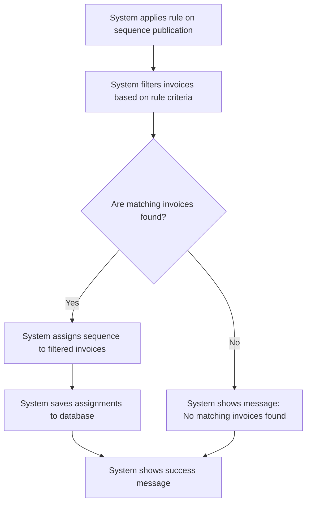

# Design: Apply Assignment Rule

## Technical Approach
The apply assignment rule feature will allow the system to automatically apply assignment rules when a sequence is published or at the end of each unpaid invoice import. The system will filter the invoices based on the rule criteria, assign the sequence to the filtered invoices, and save the assignments to the database. The frontend will use Alpine.js for reactivity and state management, while the backend will handle data processing and storage via Flask.

## Architecture Decisions

### Decision: Use Alpine.js for Frontend Reactivity
- **Description**: Alpine.js will manage the state and reactivity of the rule application process.
- **Rationale**: Alpine.js is lightweight and integrates seamlessly with HTML, making it ideal for this use case.
- **Impact**: Simplifies frontend logic and improves user experience.

### Decision: Use Flask for Backend Processing
- **Description**: Flask will handle the rule application and data storage operations.
- **Rationale**: Flask is lightweight and well-suited for handling HTTP requests and integrating with Parse.
- **Impact**: Ensures robust backend processing and easy integration with the database.

### Decision: Apply Rules Automatically
- **Description**: The system will apply assignment rules automatically upon sequence publication or at the end of each unpaid invoice import.
- **Rationale**: Automatic application ensures that rules are consistently applied without manual intervention.
- **Impact**: Improves efficiency and reduces the risk of human error.

### Decision: Filter Invoices Based on Rules
- **Description**: The system will filter invoices based on the criteria defined in the assignment rules.
- **Rationale**: Filtering ensures that only relevant invoices are assigned to the sequence.
- **Impact**: Enhances the accuracy and effectiveness of the rule application.

### Decision: Save Assignments to Database
- **Description**: The system will save the sequence assignments to the `Impayes` class in Parse.
- **Rationale**: Saving assignments ensures that the data is persistent and can be tracked.
- **Impact**: Improves data integrity and provides a record of assignments.

## Data Flow


## Data Mapping

### Parse Class: `Sequences`
- **Fields**:
  - `nom`: String (sequence name).
  - `rules`: Array (list of automatic assignment rules).

### Parse Class: `Impayes`
- **Fields**:
  - `numero_facture`: String (invoice number).
  - `sequence`: Pointer (pointer to the assigned sequence in the `Sequences` class).

### Alpine.js Store: `ruleApplication`
- **Fields**:
  - `appliedRule`: Object (the applied assignment rule).
  - `matchingInvoices`: Array (list of invoices matching the rule criteria).
  - `assignmentHistory`: Array (list of past assignments).
  - `errorMessage`: String (error message to display).
  - `successMessage`: String (success message to display).

### Data Flow
1. **Input Data**:
   - The system retrieves the assignment rules from the `Sequences` class.
   - The system retrieves the list of unpaid invoices from the `Impayes` class.

2. **Filtering**:
   - The system filters the invoices based on the criteria defined in the assignment rules.

3. **Assignment**:
   - If matching invoices are found, the system assigns the sequence to the filtered invoices.
   - If no matching invoices are found, the system displays an informative message.

4. **Saving**:
   - The system saves the sequence assignments to the `Impayes` class in Parse.

5. **Success Handling**:
   - The system displays a success message upon successful assignment.

## Screen ASCII

### Screen 1: Apply Assignment Rule
```
┌───────────────────────────────────────────────────────────────────────────────┐
│                                                                           │
│                                                                               │
│  Apply Assignment Rule                                                     │
│  Rule Applied: [Rule Name]                                                 │
│  Matching Invoices: [Number]                                                │
│                                                                               │
│  Assignment History:                                                       │
│  - 10/01/2023: 5 invoices assigned                                          │
│  - 09/01/2023: 3 invoices assigned                                          │
│                                                                               │
│  [Apply]  [Cancel]                                                          │
│                                                                               │
│                                                                           │
└───────────────────────────────────────────────────────────────────────────────┘
```

### Screen 2: No Matching Invoices
```
┌───────────────────────────────────────────────────────────────────────────────┐
│                                                                           │
│                                                                               │
│  No Matching Invoices                                                       │
│  No invoices match the rule criteria.                                        │
│                                                                               │
│  [OK]                                                                       │
│                                                                               │
│                                                                           │
└───────────────────────────────────────────────────────────────────────────────┘
```

## Components and Layouts

### Components/Partials Usage

#### Apply Assignment Rule Component
- **File**: `/templates/partials/apply_assignment_rule_component.html`
- **Role**: Displays the result of the rule application and the assignment history.
- **Dependencies**:
  - `ruleApplication` store for managing state.
  - `axiosParse` for API calls to Parse.

#### No Matching Invoices Component
- **File**: `/templates/partials/no_matching_invoices_component.html`
- **Role**: Displays a message when no invoices match the rule criteria.
- **Dependencies**:
  - `ruleApplication` store for managing state.

#### Success Message Component
- **File**: `/templates/partials/success_message_component.html`
- **Role**: Displays a success message after the rule is applied.
- **Dependencies**:
  - `ruleApplication` store for managing state.

### Layouts

#### Base Layout
- **File**: `/templates/layouts/base_layout.html`
- **Role**: Provides the basic structure for all pages, including the header, footer, and main content area.

#### Dashboard Layout
- **File**: `/templates/layouts/dashboard_layout.html`
- **Role**: Provides the structure for dashboard pages, including the header, sidebar, and main content area.
- **Components Used**:
  - `sidebarComponent`

## Data Parse Changes

### Class: `Sequences`
- **Changes**: No changes required.

### Class: `Impayes`
- **Changes**: No changes required.

## File Changes

### New Files
- `/templates/partials/apply_assignment_rule_component.html`: Component for applying assignment rules.
- `/templates/partials/no_matching_invoices_component.html`: Component for displaying messages when no matching invoices are found.
- `/templates/partials/success_message_component.html`: Component for displaying success messages.
- `/static/js/stores/ruleApplicationStore.js`: Alpine.js store for managing rule application state.

### Modified Files
- `/templates/layouts/base_layout.html`: Include the apply assignment rule component.
- `/templates/layouts/dashboard_layout.html`: Include the no matching invoices component.

## Verification
Ensure the output file is created in the correct folder with the specified structure.