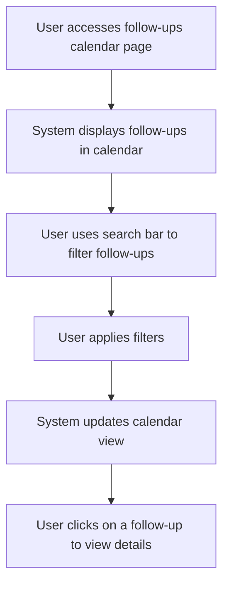

# Design: Display Follow-ups in a Calendar

## Technical Approach
The display follow-ups in a calendar feature will allow users to view follow-ups in a calendar format. The system will provide a calendar view with search and filtering options to display follow-ups based on their status (sent, not sent, paid, unpaid). The frontend will use Alpine.js for reactivity and state management, while the backend will handle data retrieval via Flask.

## Architecture Decisions

### Decision: Use Alpine.js for Frontend Reactivity
- **Description**: Alpine.js will manage the state and reactivity of the calendar display and filtering process.
- **Rationale**: Alpine.js is lightweight and integrates seamlessly with HTML, making it ideal for this use case.
- **Impact**: Simplifies frontend logic and improves user experience.

### Decision: Use Flask for Backend Processing
- **Description**: Flask will handle the retrieval of follow-ups from the `Relances` class.
- **Rationale**: Flask is lightweight and well-suited for handling HTTP requests and integrating with Parse.
- **Impact**: Ensures robust backend processing and easy integration with the database.

### Decision: Use Calendar View
- **Description**: The system will display follow-ups in a calendar view for easy navigation and visualization.
- **Rationale**: A calendar view provides a clear and intuitive way to view follow-ups over time.
- **Impact**: Improves user experience by providing a familiar and organized view of follow-ups.

### Decision: Provide Search and Filtering Options
- **Description**: The system will provide search and filtering options to allow users to find specific follow-ups.
- **Rationale**: Search and filtering options enhance usability by allowing users to quickly locate relevant follow-ups.
- **Impact**: Improves user experience by making it easier to find and manage follow-ups.

## Data Flow


## Data Mapping

### Parse Class: `Relances`
- **Fields**:
  - `date`: DateTime (date and time of the follow-up).
  - `statut`: String (status of the follow-up: sent, not sent, paid, unpaid).
  - `facture`: Pointer (pointer to the associated invoice in the `Impayes` class).
  - `details`: String (additional details about the follow-up).

### Alpine.js Store: `followUpCalendar`
- **Fields**:
  - `followUps`: Array (list of follow-ups to display).
  - `filteredFollowUps`: Array (list of filtered follow-ups based on search and filter criteria).
  - `searchQuery`: String (search query for filtering follow-ups).
  - `filters`: Object (selected filters for displaying follow-ups).
  - `selectedFollowUp`: Object (selected follow-up for viewing details).

### Data Flow
1. **Input Data**:
   - The user accesses the follow-ups calendar page.
   - The system retrieves the list of follow-ups from the `Relances` class.

2. **Display**:
   - The system displays the follow-ups in a calendar view.

3. **Search and Filtering**:
   - The user inputs a search query or applies filters to narrow down the list of follow-ups.
   - The system updates the calendar view based on the search query and selected filters.

4. **View Details**:
   - The user clicks on a follow-up to view its details.
   - The system displays the details of the selected follow-up.

## Screen ASCII

### Screen 1: Follow-ups Calendar
```
┌───────────────────────────────────────────────────────────────────────────────┐
│                                                                           │
│                                                                               │
│  Follow-ups Calendar                                                        │
│  View follow-ups in a calendar                                               │
│                                                                               │
│  [Search Bar]                                                                │
│                                                                               │
│  Filters:                                                                   │
│  [Sent Emails]  [Unsent Emails]  [Paid Invoices]  [Unpaid Invoices]            │
│                                                                               │
│  Month Navigation:                                                          │
│  [Previous]  January 2023  [Next]                                           │
│                                                                               │
│  Calendar View:                                                             │
│  Sun  Mon  Tue  Wed  Thu  Fri  Sat                                          │
│  [1]  [2]  [3]  [4]  [5]  [6]  [7]                                           │
│  [8]  [9]  [10] [11] [12] [13] [14]                                          │
│  [15] [16] [17] [18] [19] [20] [21]                                          │
│  [22] [23] [24] [25] [26] [27] [28]                                          │
│  [29] [30] [31]                                                              │
│                                                                               │
│  Follow-up Details:                                                         │
│  Date: 15/01/2023                                                           │
│  Time: 10:00 AM                                                              │
│  Status: Sent                                                                │
│  Invoice: INV001                                                             │
│  Details: Follow-up email sent to client.                                    │
│                                                                               │
│                                                                           │
└───────────────────────────────────────────────────────────────────────────────┘
```

## Components and Layouts

### Components/Partials Usage

#### Follow-ups Calendar Component
- **File**: `/templates/partials/follow_up_calendar_component.html`
- **Role**: Displays the follow-ups in a calendar view with search and filtering options.
- **Dependencies**:
  - `followUpCalendar` store for managing state.
  - `axiosParse` for API calls to Parse.

#### Follow-up Details Component
- **File**: `/templates/partials/follow_up_details_component.html`
- **Role**: Displays the details of a selected follow-up.
- **Dependencies**:
  - `followUpCalendar` store for managing state.

### Layouts

#### Base Layout
- **File**: `/templates/layouts/base_layout.html`
- **Role**: Provides the basic structure for all pages, including the header, footer, and main content area.

#### Dashboard Layout
- **File**: `/templates/layouts/dashboard_layout.html`
- **Role**: Provides the structure for dashboard pages, including the header, sidebar, and main content area.
- **Components Used**:
  - `sidebarComponent`

## Data Parse Changes

### Class: `Relances`
- **Changes**: No changes required.

## File Changes

### New Files
- `/templates/partials/follow_up_calendar_component.html`: Component for displaying follow-ups in a calendar.
- `/templates/partials/follow_up_details_component.html`: Component for displaying follow-up details.
- `/static/js/stores/followUpCalendarStore.js`: Alpine.js store for managing follow-up calendar state.

### Modified Files
- `/templates/layouts/base_layout.html`: Include the follow-ups calendar component.
- `/templates/layouts/dashboard_layout.html`: Include the follow-up details component.

## Verification
Ensure the output file is created in the correct folder with the specified structure.