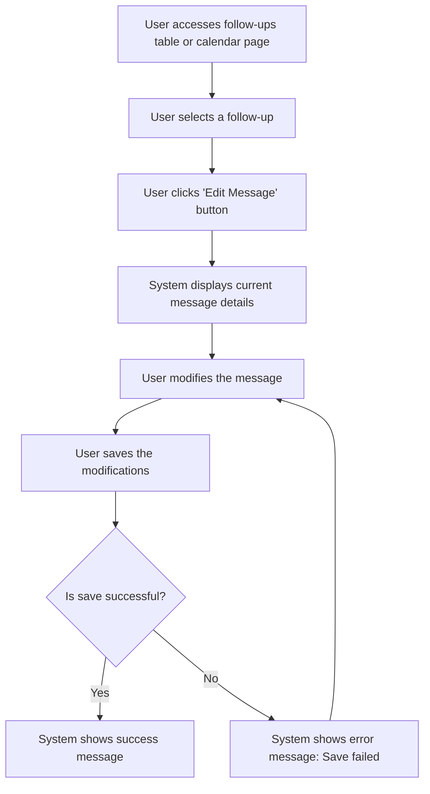

# Design: Edit Follow-up Message

## Technical Approach
The edit follow-up message feature will allow users to modify the messages of individual follow-ups. The system will provide a form to edit the message details, including subject, SMTP profile, and content. The frontend will use Alpine.js for reactivity and state management, while the backend will handle data storage via Flask.

## Architecture Decisions

### Decision: Use Alpine.js for Frontend Reactivity
- **Description**: Alpine.js will manage the state and reactivity of the message editing process.
- **Rationale**: Alpine.js is lightweight and integrates seamlessly with HTML, making it ideal for this use case.
- **Impact**: Simplifies frontend logic and improves user experience.

### Decision: Use Flask for Backend Processing
- **Description**: Flask will handle the message editing and data storage operations.
- **Rationale**: Flask is lightweight and well-suited for handling HTTP requests and integrating with Parse.
- **Impact**: Ensures robust backend processing and easy integration with the database.

### Decision: Provide Rich Text Editing
- **Description**: The system will provide a rich text editor for modifying the message content.
- **Rationale**: A rich text editor enhances the user experience by allowing easy formatting and editing of the message.
- **Impact**: Improves user experience by providing a user-friendly interface for message editing.

### Decision: Validate Messages
- **Description**: The system will validate messages before saving them to ensure they are correctly formatted.
- **Rationale**: Validation ensures that messages are functional and reduces errors.
- **Impact**: Improves data quality and user experience.

## Data Flow


## Data Mapping

### Parse Class: `Relances`
- **Fields**:
  - `sujet`: String (subject of the follow-up message).
  - `profilSMTP`: Pointer (pointer to the SMTP profile in the `SMTPProfiles` class).
  - `objet`: String (object of the follow-up message).
  - `message`: String (content of the follow-up message).

### Alpine.js Store: `followUpMessageEditing`
- **Fields**:
  - `selectedFollowUp`: Object (selected follow-up for editing).
  - `messageSubject`: String (subject of the follow-up message).
  - `smtpProfile`: Object (selected SMTP profile).
  - `messageObject`: String (object of the follow-up message).
  - `messageContent`: String (content of the follow-up message).
  - `errorMessage`: String (error message to display).
  - `successMessage`: String (success message to display).

### Data Flow
1. **Input Data**:
   - The user selects a follow-up from the table or calendar view.
   - The system retrieves the follow-up details from the `Relances` class.

2. **Display**:
   - The system displays the current message details, including subject, SMTP profile, and content.

3. **Editing**:
   - The user modifies the message details using the provided form.

4. **Saving**:
   - The user saves the modifications to the follow-up message.
   - The system validates the message and saves it to the `Relances` class in Parse.

5. **Success Handling**:
   - If the message is saved successfully, the system displays a success message.

6. **Error Handling**:
   - If the message cannot be saved, the system displays an error message and prompts the user to retry.

## Screen ASCII

### Screen 1: Edit Follow-up Message
```
┌───────────────────────────────────────────────────────────────────────────────┐
│                                                                           │
│                                                                               │
│  Edit Follow-up Message                                                      │
│  Modify the details of the follow-up message                                 │
│                                                                               │
│  Subject: [________________________________________________________________]   │
│  SMTP Profile: [_______________________________________________________]       │
│  Object: [________________________________________________________________]     │
│                                                                               │
│  Message:                                                                   │
│  [_________________________________________________________________]          │
│  [_________________________________________________________________]          │
│  [_________________________________________________________________]          │
│                                                                               │
│  [Edit with AI]  [Save]  [Cancel]                                            │
│                                                                               │
│                                                                           │
└───────────────────────────────────────────────────────────────────────────────┘
```

## Components and Layouts

### Components/Partials Usage

#### Follow-ups Table Component
- **File**: `/templates/partials/follow_up_table_component.html`
- **Role**: Displays the follow-ups in a table view and provides options to edit messages.
- **Dependencies**:
  - `followUpMessageEditing` store for managing state.
  - `axiosParse` for API calls to Parse.

#### Follow-ups Calendar Component
- **File**: `/templates/partials/follow_up_calendar_component.html`
- **Role**: Displays the follow-ups in a calendar view and provides options to edit messages.
- **Dependencies**:
  - `followUpMessageEditing` store for managing state.

#### Edit Follow-up Message Component
- **File**: `/templates/partials/edit_follow_up_message_component.html`
- **Role**: Handles the editing of a follow-up message.
- **Dependencies**:
  - `followUpMessageEditing` store for managing state.
  - `Toast Editor UI` for rich text editing.

#### Success Message Component
- **File**: `/templates/partials/success_message_component.html`
- **Role**: Displays a success message after a follow-up message is edited.
- **Dependencies**:
  - `followUpMessageEditing` store for managing state.

#### Error Message Component
- **File**: `/templates/partials/error_message_component.html`
- **Role**: Displays error messages during the message editing process.
- **Dependencies**:
  - `followUpMessageEditing` store for managing state.

### Layouts

#### Base Layout
- **File**: `/templates/layouts/base_layout.html`
- **Role**: Provides the basic structure for all pages, including the header, footer, and main content area.

#### Dashboard Layout
- **File**: `/templates/layouts/dashboard_layout.html`
- **Role**: Provides the structure for dashboard pages, including the header, sidebar, and main content area.
- **Components Used**:
  - `sidebarComponent`

## Data Parse Changes

### Class: `Relances`
- **Changes**: No changes required.

## File Changes

### New Files
- `/templates/partials/follow_up_table_component.html`: Component for displaying follow-ups in a table.
- `/templates/partials/follow_up_calendar_component.html`: Component for displaying follow-ups in a calendar.
- `/templates/partials/edit_follow_up_message_component.html`: Component for editing follow-up messages.
- `/templates/partials/success_message_component.html`: Component for displaying success messages.
- `/templates/partials/error_message_component.html`: Component for displaying error messages.
- `/static/js/stores/followUpMessageEditingStore.js`: Alpine.js store for managing follow-up message editing state.

### Modified Files
- `/templates/layouts/base_layout.html`: Include the follow-ups table and calendar components.
- `/templates/layouts/dashboard_layout.html`: Include the edit follow-up message component.

## Verification
Ensure the output file is created in the correct folder with the specified structure.