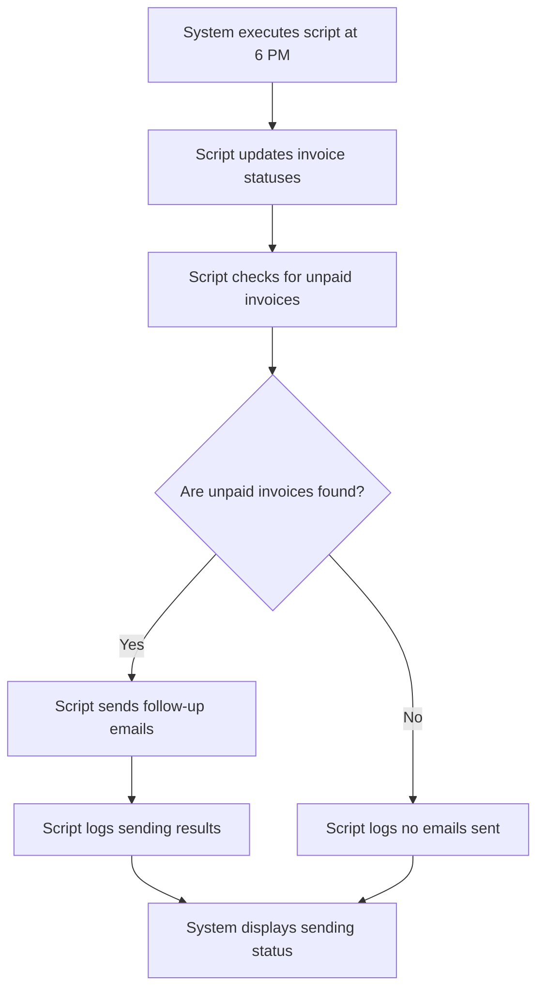

# Design: Schedule Email Sending

## Technical Approach
The schedule email sending feature will allow the system to automatically send follow-up emails at 6 PM every day. The system will execute a script to update statuses, verify unpaid invoices, send follow-up emails, and log the sending process. The frontend will use Alpine.js for reactivity and state management, while the backend will handle the script execution and logging via Flask.

## Architecture Decisions

### Decision: Use Alpine.js for Frontend Reactivity
- **Description**: Alpine.js will manage the state and reactivity of the email scheduling process.
- **Rationale**: Alpine.js is lightweight and integrates seamlessly with HTML, making it ideal for this use case.
- **Impact**: Simplifies frontend logic and improves user experience.

### Decision: Use Flask for Backend Processing
- **Description**: Flask will handle the script execution and logging operations.
- **Rationale**: Flask is lightweight and well-suited for handling HTTP requests and integrating with Parse.
- **Impact**: Ensures robust backend processing and easy integration with the database.

### Decision: Execute Script at 6 PM
- **Description**: The system will execute the email sending script at 6 PM every day.
- **Rationale**: A fixed schedule ensures that emails are sent consistently and at a predictable time.
- **Impact**: Improves reliability and user experience by providing a consistent sending time.

### Decision: Update Statuses Before Sending
- **Description**: The system will update the statuses of invoices before sending follow-up emails.
- **Rationale**: Updating statuses ensures that only relevant and unpaid invoices are included in the follow-up emails.
- **Impact**: Enhances the accuracy and effectiveness of the follow-up process.

### Decision: Log Sending Process
- **Description**: The system will log the sending process, including successes and failures.
- **Rationale**: Logging provides a record of the sending process and helps in troubleshooting.
- **Impact**: Improves transparency and accountability.

## Data Flow


## Data Mapping

### Parse Class: `Relances`
- **Fields**:
  - `date`: DateTime (date and time of the follow-up).
  - `statut`: String (status of the follow-up: sent, not sent, paid, unpaid).
  - `facture`: Pointer (pointer to the associated invoice in the `Impayes` class).
  - `logs`: Array (list of sending logs).

### Parse Class: `Impayes`
- **Fields**:
  - `numero_facture`: String (invoice number).
  - `statut`: String (invoice status: paid, unpaid).
  - `date`: Date (invoice date).
  - `montant`: Number (invoice amount).

### Alpine.js Store: `emailScheduling`
- **Fields**:
  - `scheduledEmails`: Array (list of scheduled emails).
  - `sendingStatus`: String (status of the email sending process).
  - `logs`: Array (list of sending logs).
  - `errorMessage`: String (error message to display).
  - `successMessage`: String (success message to display).

### Data Flow
1. **Input Data**:
   - The system executes the email sending script at 6 PM every day.
   - The system retrieves the list of unpaid invoices from the `Impayes` class.

2. **Status Update**:
   - The system updates the statuses of invoices to ensure they are current.

3. **Email Sending**:
   - The system sends follow-up emails to the contacts associated with unpaid invoices.

4. **Logging**:
   - The system logs the results of the email sending process, including successes and failures.

5. **Status Display**:
   - The system displays the status of the email sending process to the user.

## Screen ASCII

### Screen 1: Email Scheduling
```
┌───────────────────────────────────────────────────────────────────────────────┐
│                                                                           │
│                                                                               │
│  Email Scheduling                                                           │
│  Schedule the sending of follow-up emails                                    │
│                                                                               │
│  Sending Time: 6 PM                                                         │
│  Scheduled Emails: [Number]                                                 │
│                                                                               │
│  [Execute]  [Cancel]                                                        │
│                                                                               │
│                                                                           │
└───────────────────────────────────────────────────────────────────────────────┘
```

## Components and Layouts

### Components/Partials Usage

#### Email Scheduling Component
- **File**: `/templates/partials/email_scheduling_component.html`
- **Role**: Displays the email scheduling status and provides options to execute or cancel the sending process.
- **Dependencies**:
  - `emailScheduling` store for managing state.
  - `axiosParse` for API calls to Parse.

#### Success Message Component
- **File**: `/templates/partials/success_message_component.html`
- **Role**: Displays a success message after the emails are sent.
- **Dependencies**:
  - `emailScheduling` store for managing state.

#### Error Message Component
- **File**: `/templates/partials/error_message_component.html`
- **Role**: Displays error messages during the email sending process.
- **Dependencies**:
  - `emailScheduling` store for managing state.

### Layouts

#### Base Layout
- **File**: `/templates/layouts/base_layout.html`
- **Role**: Provides the basic structure for all pages, including the header, footer, and main content area.

#### Dashboard Layout
- **File**: `/templates/layouts/dashboard_layout.html`
- **Role**: Provides the structure for dashboard pages, including the header, sidebar, and main content area.
- **Components Used**:
  - `sidebarComponent`

## Data Parse Changes

### Class: `Relances`
- **New Field**:
  - `logs`: Array (list of sending logs).

### Class: `Impayes`
- **Changes**: No changes required.

## File Changes

### New Files
- `/templates/partials/email_scheduling_component.html`: Component for scheduling email sending.
- `/templates/partials/success_message_component.html`: Component for displaying success messages.
- `/templates/partials/error_message_component.html`: Component for displaying error messages.
- `/static/js/stores/emailSchedulingStore.js`: Alpine.js store for managing email scheduling state.

### Modified Files
- `/templates/layouts/base_layout.html`: Include the email scheduling component.
- `/templates/layouts/dashboard_layout.html`: Include the success and error message components.

## Verification
Ensure the output file is created in the correct folder with the specified structure.