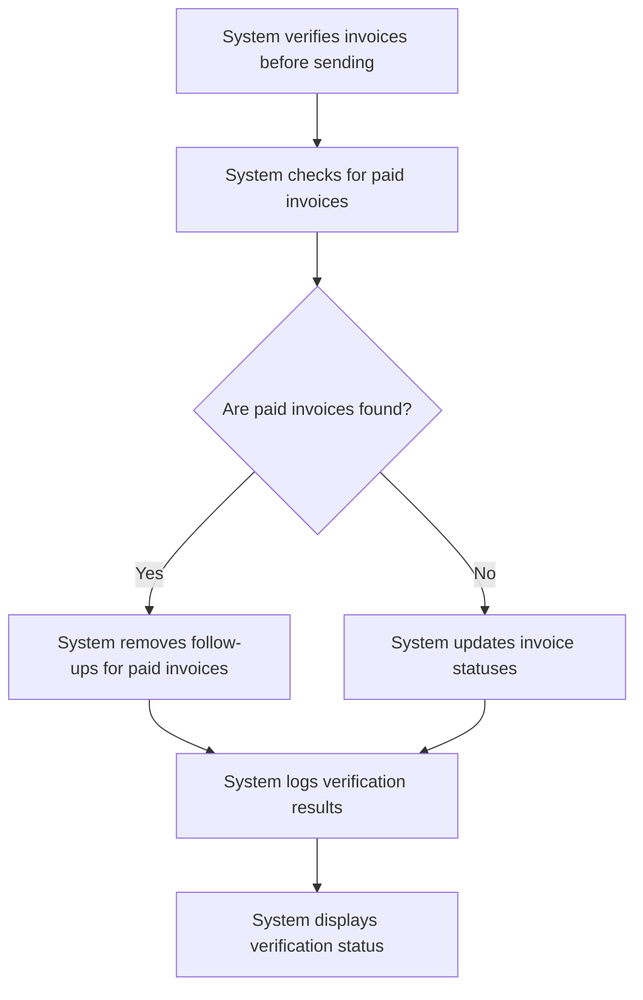

# Design: Verify Invoices Before Sending

## Technical Approach
The verify invoices before sending feature will ensure that invoices are checked and updated before sending follow-up emails. The system will verify that invoices are not paid, update their statuses, and remove follow-ups for paid invoices. The frontend will use Alpine.js for reactivity and state management, while the backend will handle the verification and logging via Flask.

## Architecture Decisions

### Decision: Use Alpine.js for Frontend Reactivity
- **Description**: Alpine.js will manage the state and reactivity of the invoice verification process.
- **Rationale**: Alpine.js is lightweight and integrates seamlessly with HTML, making it ideal for this use case.
- **Impact**: Simplifies frontend logic and improves user experience.

### Decision: Use Flask for Backend Processing
- **Description**: Flask will handle the invoice verification and logging operations.
- **Rationale**: Flask is lightweight and well-suited for handling HTTP requests and integrating with Parse.
- **Impact**: Ensures robust backend processing and easy integration with the database.

### Decision: Verify Invoices Before Sending
- **Description**: The system will verify that invoices are not paid before sending follow-up emails.
- **Rationale**: Verification ensures that follow-up emails are only sent for relevant and unpaid invoices.
- **Impact**: Enhances the accuracy and effectiveness of the follow-up process.

### Decision: Update Invoice Statuses
- **Description**: The system will update the statuses of invoices to ensure they are current.
- **Rationale**: Updating statuses ensures that the system has the latest information about the invoices.
- **Impact**: Improves data integrity and reduces errors.

### Decision: Remove Follow-ups for Paid Invoices
- **Description**: The system will remove follow-ups for paid invoices to avoid sending unnecessary emails.
- **Rationale**: Removing follow-ups for paid invoices ensures that only relevant follow-ups are sent.
- **Impact**: Enhances the efficiency and effectiveness of the follow-up process.

### Decision: Log Verification Process
- **Description**: The system will log the verification process, including successes and failures.
- **Rationale**: Logging provides a record of the verification process and helps in troubleshooting.
- **Impact**: Improves transparency and accountability.

## Data Flow


## Data Mapping

### Parse Class: `Relances`
- **Fields**:
  - `facture`: Pointer (pointer to the associated invoice in the `Impayes` class).
  - `statut`: String (status of the follow-up: sent, not sent, paid, unpaid).
  - `logs`: Array (list of verification logs).

### Parse Class: `Impayes`
- **Fields**:
  - `numero_facture`: String (invoice number).
  - `statut`: String (invoice status: paid, unpaid).
  - `date_paiement`: Date (payment date of the invoice).

### Alpine.js Store: `invoiceVerification`
- **Fields**:
  - `verifiedInvoices`: Array (list of verified invoices).
  - `paidInvoices`: Array (list of paid invoices).
  - `verificationStatus`: String (status of the verification process).
  - `logs`: Array (list of verification logs).
  - `errorMessage`: String (error message to display).
  - `successMessage`: String (success message to display).

### Data Flow
1. **Input Data**:
   - The system retrieves the list of invoices from the `Impayes` class.
   - The system retrieves the list of follow-ups from the `Relances` class.

2. **Verification**:
   - The system checks for paid invoices and updates their statuses.

3. **Removal**:
   - The system removes follow-ups for paid invoices to avoid sending unnecessary emails.

4. **Logging**:
   - The system logs the results of the verification process, including successes and failures.

5. **Status Display**:
   - The system displays the status of the verification process to the user.

## Screen ASCII

### Screen 1: Invoice Verification
```
┌───────────────────────────────────────────────────────────────────────────────┐
│                                                                           │
│                                                                               │
│  Invoice Verification                                                       │
│  Verify invoices before sending follow-up emails                              │
│                                                                               │
│  Verified Invoices: [Number]                                                │
│  Paid Invoices: [Number]                                                    │
│                                                                               │
│  [Update]  [Cancel]                                                          │
│                                                                               │
│                                                                           │
└───────────────────────────────────────────────────────────────────────────────┘
```

## Components and Layouts

### Components/Partials Usage

#### Invoice Verification Component
- **File**: `/templates/partials/invoice_verification_component.html`
- **Role**: Displays the invoice verification status and provides options to update or cancel the verification process.
- **Dependencies**:
  - `invoiceVerification` store for managing state.
  - `axiosParse` for API calls to Parse.

#### Success Message Component
- **File**: `/templates/partials/success_message_component.html`
- **Role**: Displays a success message after the invoices are verified.
- **Dependencies**:
  - `invoiceVerification` store for managing state.

#### Error Message Component
- **File**: `/templates/partials/error_message_component.html`
- **Role**: Displays error messages during the invoice verification process.
- **Dependencies**:
  - `invoiceVerification` store for managing state.

### Layouts

#### Base Layout
- **File**: `/templates/layouts/base_layout.html`
- **Role**: Provides the basic structure for all pages, including the header, footer, and main content area.

#### Dashboard Layout
- **File**: `/templates/layouts/dashboard_layout.html`
- **Role**: Provides the structure for dashboard pages, including the header, sidebar, and main content area.
- **Components Used**:
  - `sidebarComponent`

## Data Parse Changes

### Class: `Relances`
- **New Field**:
  - `logs`: Array (list of verification logs).

### Class: `Impayes`
- **New Field**:
  - `date_paiement`: Date (payment date of the invoice).

## File Changes

### New Files
- `/templates/partials/invoice_verification_component.html`: Component for verifying invoices.
- `/templates/partials/success_message_component.html`: Component for displaying success messages.
- `/templates/partials/error_message_component.html`: Component for displaying error messages.
- `/static/js/stores/invoiceVerificationStore.js`: Alpine.js store for managing invoice verification state.

### Modified Files
- `/templates/layouts/base_layout.html`: Include the invoice verification component.
- `/templates/layouts/dashboard_layout.html`: Include the success and error message components.

## Verification
Ensure the output file is created in the correct folder with the specified structure.