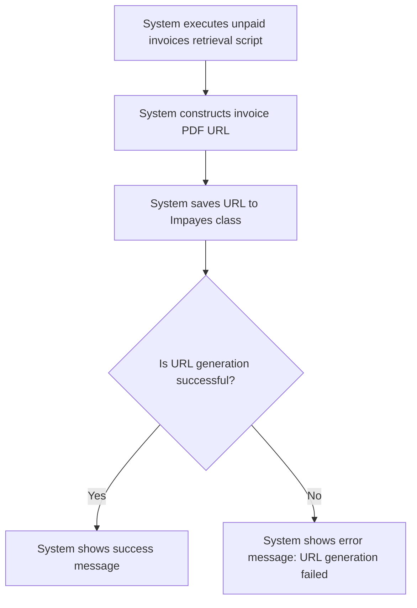

# Design: Generate URL for Invoice PDF

## Technical Approach
The generate URL for invoice PDF feature will allow the system to automatically generate the URL for the invoice PDF when retrieving unpaid invoices. The system will construct the URL using the format defined in `@elements_important/format_url_facture.md` and save it to the `url_facture` column in the `Impayes` class. The frontend will use Alpine.js for reactivity and state management, while the backend will handle the URL generation and storage via Flask.

## Architecture Decisions

### Decision: Use Alpine.js for Frontend Reactivity
- **Description**: Alpine.js will manage the state and reactivity of the URL generation process.
- **Rationale**: Alpine.js is lightweight and integrates seamlessly with HTML, making it ideal for this use case.
- **Impact**: Simplifies frontend logic and improves user experience.

### Decision: Use Flask for Backend Processing
- **Description**: Flask will handle the URL generation and storage operations.
- **Rationale**: Flask is lightweight and well-suited for handling HTTP requests and integrating with Parse.
- **Impact**: Ensures robust backend processing and easy integration with the database.

### Decision: Use Defined URL Format
- **Description**: The system will use the URL format defined in `@elements_important/format_url_facture.md`.
- **Rationale**: A defined format ensures consistency and ease of use.
- **Impact**: Enhances the reliability and usability of the generated URLs.

### Decision: Configure FTP Access in `.env`
- **Description**: FTP access details will be configured in the `.env` file.
- **Rationale**: Centralizing configuration in the `.env` file ensures security and ease of management.
- **Impact**: Improves security and simplifies configuration management.

## Data Flow


## Data Mapping

### Parse Class: `Impayes`
- **Fields**:
  - `numero_facture`: String (invoice number).
  - `url_facture`: String (URL of the invoice PDF).

### File: `@elements_important/format_url_facture.md`
- **Fields**:
  - `format`: String (format for constructing the invoice PDF URL).

### Alpine.js Store: `invoiceUrlGeneration`
- **Fields**:
  - `invoiceNumber`: String (invoice number).
  - `generatedUrl`: String (generated URL for the invoice PDF).
  - `errorMessage`: String (error message to display).
  - `successMessage`: String (success message to display).

### Data Flow
1. **Input Data**:
   - The system executes the unpaid invoices retrieval script.
   - The system retrieves the invoice details from the `Impayes` class.

2. **URL Construction**:
   - The system constructs the invoice PDF URL using the format defined in `@elements_important/format_url_facture.md`.

3. **URL Saving**:
   - The system saves the generated URL to the `url_facture` column in the `Impayes` class.

4. **Success Handling**:
   - If the URL is generated and saved successfully, the system displays a success message.

5. **Error Handling**:
   - If the URL cannot be generated or saved, the system displays an error message and logs the error details.

## Screen ASCII

### Screen 1: Generate Invoice PDF URL
```
┌───────────────────────────────────────────────────────────────────────────────┐
│                                                                           │
│                                                                               │
│  Generate Invoice PDF URL                                                  │
│  Automatically generate the URL for the invoice PDF                         │
│                                                                               │
│  Invoice Number: [Invoice Number]                                            │
│  Generated URL: [Generated URL]                                             │
│                                                                               │
│  [Generate URL]  [Cancel]                                                   │
│                                                                               │
│                                                                           │
└───────────────────────────────────────────────────────────────────────────────┘
```

## Components and Layouts

### Components/Partials Usage

#### Generate Invoice PDF URL Component
- **File**: `/templates/partials/generate_invoice_pdf_url_component.html`
- **Role**: Displays the invoice details and generated URL, and provides options to generate or cancel the URL.
- **Dependencies**:
  - `invoiceUrlGeneration` store for managing state.
  - `axiosParse` for API calls to Parse.

#### Success Message Component
- **File**: `/templates/partials/success_message_component.html`
- **Role**: Displays a success message after the URL is generated.
- **Dependencies**:
  - `invoiceUrlGeneration` store for managing state.

#### Error Message Component
- **File**: `/templates/partials/error_message_component.html`
- **Role**: Displays error messages during the URL generation process.
- **Dependencies**:
  - `invoiceUrlGeneration` store for managing state.

### Layouts

#### Base Layout
- **File**: `/templates/layouts/base_layout.html`
- **Role**: Provides the basic structure for all pages, including the header, footer, and main content area.

#### Dashboard Layout
- **File**: `/templates/layouts/dashboard_layout.html`
- **Role**: Provides the structure for dashboard pages, including the header, sidebar, and main content area.
- **Components Used**:
  - `sidebarComponent`

## Data Parse Changes

### Class: `Impayes`
- **New Field**:
  - `url_facture`: String (URL of the invoice PDF).

## File Changes

### New Files
- `/templates/partials/generate_invoice_pdf_url_component.html`: Component for generating invoice PDF URLs.
- `/templates/partials/success_message_component.html`: Component for displaying success messages.
- `/templates/partials/error_message_component.html`: Component for displaying error messages.
- `/static/js/stores/invoiceUrlGenerationStore.js`: Alpine.js store for managing invoice URL generation state.

### Modified Files
- `/templates/layouts/base_layout.html`: Include the generate invoice PDF URL component.
- `/templates/layouts/dashboard_layout.html`: Include the success and error message components.

## Verification
Ensure the output file is created in the correct folder with the specified structure.