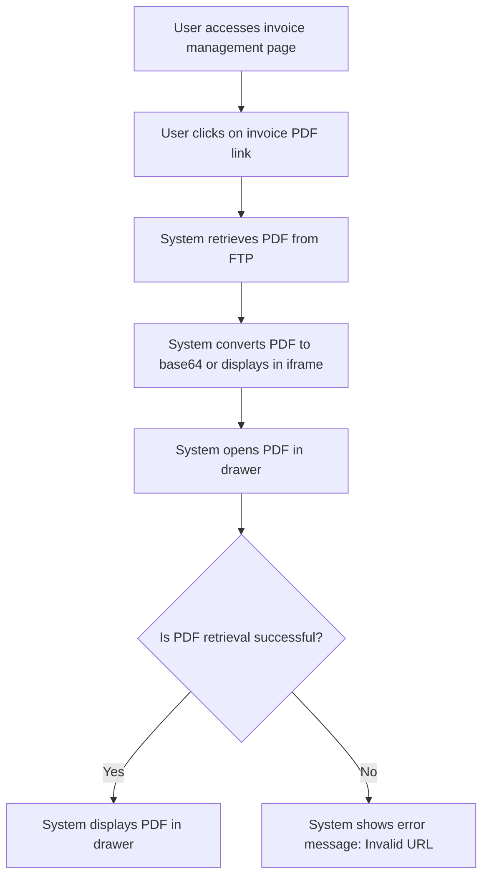

# Design: Display Invoice PDF

## Technical Approach
The display invoice PDF feature will allow users to view an invoice PDF directly within the interface. The system will retrieve the PDF from the FTP server using the generated URL, convert it to base64 or display it directly in an iframe, and open it in a drawer that covers 50% of the screen. The frontend will use Alpine.js for reactivity and state management, while the backend will handle the PDF retrieval via Flask.

## Architecture Decisions

### Decision: Use Alpine.js for Frontend Reactivity
- **Description**: Alpine.js will manage the state and reactivity of the PDF display process.
- **Rationale**: Alpine.js is lightweight and integrates seamlessly with HTML, making it ideal for this use case.
- **Impact**: Simplifies frontend logic and improves user experience.

### Decision: Use Flask for Backend Processing
- **Description**: Flask will handle the PDF retrieval from the FTP server.
- **Rationale**: Flask is lightweight and well-suited for handling HTTP requests and integrating with Parse.
- **Impact**: Ensures robust backend processing and easy integration with the database.

### Decision: Retrieve PDF from FTP
- **Description**: The system will retrieve the PDF from the FTP server using the generated URL.
- **Rationale**: Retrieving the PDF from the FTP server ensures that the latest version is displayed.
- **Impact**: Improves the accuracy and reliability of the displayed PDF.

### Decision: Display PDF in Drawer
- **Description**: The system will display the PDF in a drawer that covers 50% of the screen.
- **Rationale**: A drawer provides a non-intrusive way to display the PDF while keeping the main interface visible.
- **Impact**: Improves user experience by allowing easy access to the PDF without losing context.

### Decision: Convert PDF to Base64 or Display in Iframe
- **Description**: The system will convert the PDF to base64 or display it directly in an iframe.
- **Rationale**: Converting the PDF to base64 or displaying it in an iframe ensures compatibility and ease of display.
- **Impact**: Enhances the usability and accessibility of the PDF.

## Data Flow


## Data Mapping

### Parse Class: `Impayes`
- **Fields**:
  - `numero_facture`: String (invoice number).
  - `url_facture`: String (URL of the invoice PDF).

### Alpine.js Store: `invoicePdfDisplay`
- **Fields**:
  - `invoiceNumber`: String (invoice number).
  - `pdfUrl`: String (URL of the invoice PDF).
  - `pdfBase64`: String (base64 representation of the PDF).
  - `isDrawerOpen`: Boolean (indicates if the drawer is open).
  - `errorMessage`: String (error message to display).

### Data Flow
1. **Input Data**:
   - The user clicks on the invoice PDF link in the invoice management page.
   - The system retrieves the PDF URL from the `Impayes` class.

2. **PDF Retrieval**:
   - The system retrieves the PDF from the FTP server using the generated URL.

3. **PDF Conversion**:
   - The system converts the PDF to base64 or prepares it for display in an iframe.

4. **PDF Display**:
   - The system opens the PDF in a drawer that covers 50% of the screen.

5. **Success Handling**:
   - If the PDF is retrieved and displayed successfully, the system displays it in the drawer.

6. **Error Handling**:
   - If the PDF cannot be retrieved, the system displays an error message.

## Screen ASCII

### Screen 1: Display Invoice PDF
```
┌───────────────────────────────────────────────────────────────────────────────┐
│                                                                           │
│                                                                               │
│  Display Invoice PDF                                                       │
│  View the invoice PDF in the interface                                       │
│                                                                               │
│  Invoice PDF:                                                               │
│  [PDF Viewer]                                                               │
│                                                                               │
│  [Download]  [Close]                                                         │
│                                                                               │
│                                                                           │
└───────────────────────────────────────────────────────────────────────────────┘
```

## Components and Layouts

### Components/Partials Usage

#### Invoice Management Component
- **File**: `/templates/partials/invoice_management_component.html`
- **Role**: Displays the list of invoices and provides options to view PDFs.
- **Dependencies**:
  - `invoicePdfDisplay` store for managing state.
  - `axiosParse` for API calls to Parse.

#### Display Invoice PDF Component
- **File**: `/templates/partials/display_invoice_pdf_component.html`
- **Role**: Displays the invoice PDF in a drawer.
- **Dependencies**:
  - `invoicePdfDisplay` store for managing state.

#### Error Message Component
- **File**: `/templates/partials/error_message_component.html`
- **Role**: Displays error messages during the PDF display process.
- **Dependencies**:
  - `invoicePdfDisplay` store for managing state.

### Layouts

#### Base Layout
- **File**: `/templates/layouts/base_layout.html`
- **Role**: Provides the basic structure for all pages, including the header, footer, and main content area.

#### Dashboard Layout
- **File**: `/templates/layouts/dashboard_layout.html`
- **Role**: Provides the structure for dashboard pages, including the header, sidebar, and main content area.
- **Components Used**:
  - `sidebarComponent`

## Data Parse Changes

### Class: `Impayes`
- **Changes**: No changes required.

## File Changes

### New Files
- `/templates/partials/invoice_management_component.html`: Component for managing invoices.
- `/templates/partials/display_invoice_pdf_component.html`: Component for displaying invoice PDFs.
- `/templates/partials/error_message_component.html`: Component for displaying error messages.
- `/static/js/stores/invoicePdfDisplayStore.js`: Alpine.js store for managing invoice PDF display state.

### Modified Files
- `/templates/layouts/base_layout.html`: Include the invoice management component.
- `/templates/layouts/dashboard_layout.html`: Include the display invoice PDF component.

## Verification
Ensure the output file is created in the correct folder with the specified structure.