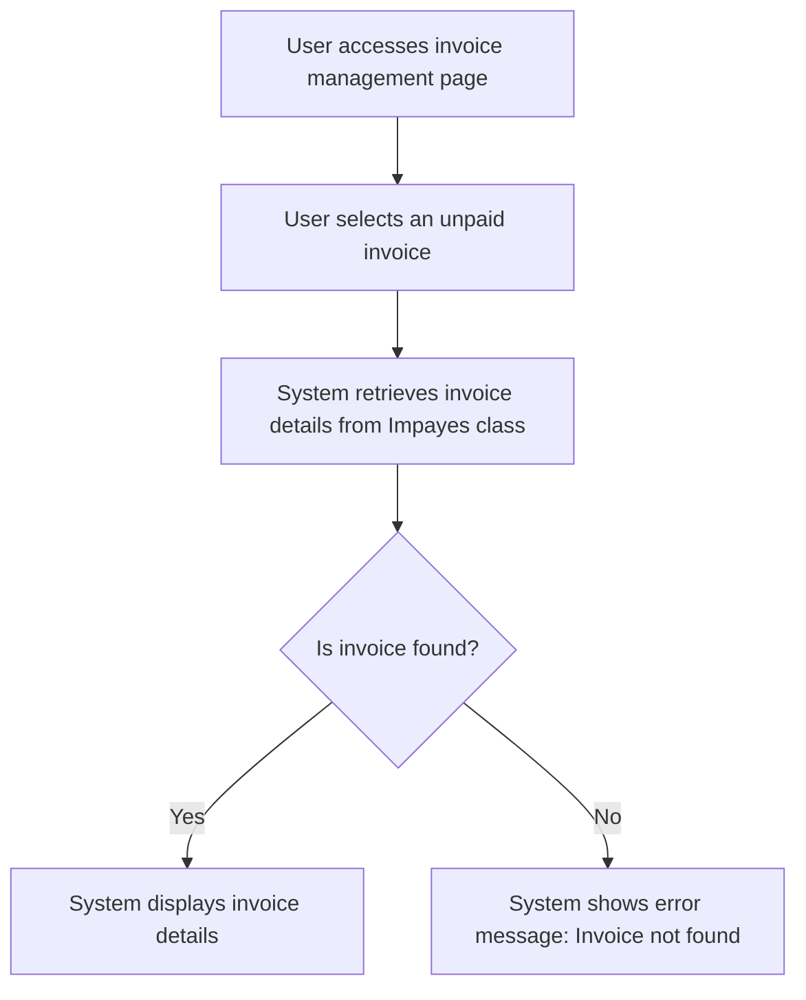

# Design: Display Invoice Details

## Technical Approach
The display invoice details feature will allow users to view the details of an unpaid invoice. The system will retrieve the invoice details from the `Impayes` class and display them in a structured format, including invoice number, date, amount, status, contact details, action history, and associated follow-ups. The frontend will use Alpine.js for reactivity and state management, while the backend will handle data retrieval via Flask.

## Architecture Decisions

### Decision: Use Alpine.js for Frontend Reactivity
- **Description**: Alpine.js will manage the state and reactivity of the invoice details display process.
- **Rationale**: Alpine.js is lightweight and integrates seamlessly with HTML, making it ideal for this use case.
- **Impact**: Simplifies frontend logic and improves user experience.

### Decision: Use Flask for Backend Processing
- **Description**: Flask will handle the retrieval of invoice details from the `Impayes` class.
- **Rationale**: Flask is lightweight and well-suited for handling HTTP requests and integrating with Parse.
- **Impact**: Ensures robust backend processing and easy integration with the database.

### Decision: Display Comprehensive Invoice Details
- **Description**: The system will display comprehensive details of the invoice, including all relevant information.
- **Rationale**: Comprehensive details provide users with a complete view of the invoice and its history.
- **Impact**: Enhances the usability and usefulness of the invoice details page.

### Decision: Provide Access to Related Actions and Follow-ups
- **Description**: The system will provide access to related actions and follow-ups for the invoice.
- **Rationale**: Access to related actions and follow-ups allows users to manage the invoice effectively.
- **Impact**: Improves the functionality and utility of the invoice details page.

## Data Flow


## Data Mapping

### Parse Class: `Impayes`
- **Fields**:
  - `numero_facture`: String (invoice number).
  - `date`: Date (invoice date).
  - `montant`: Number (invoice amount).
  - `statut`: String (invoice status).
  - `details_contact`: String (contact details).
  - `historique_actions`: Array (list of action history).
  - `relances`: Array (list of associated follow-ups).

### Parse Class: `Relances`
- **Fields**:
  - `date`: DateTime (date and time of the follow-up).
  - `statut`: String (status of the follow-up).
  - `message`: String (message content of the follow-up).

### Alpine.js Store: `invoiceDetails`
- **Fields**:
  - `invoiceNumber`: String (invoice number).
  - `invoiceDate`: Date (invoice date).
  - `invoiceAmount`: Number (invoice amount).
  - `invoiceStatus`: String (invoice status).
  - `contactDetails`: String (contact details).
  - `actionHistory`: Array (list of action history).
  - `associatedFollowUps`: Array (list of associated follow-ups).
  - `errorMessage`: String (error message to display).

### Data Flow
1. **Input Data**:
   - The user selects an unpaid invoice from the invoice management page.
   - The system retrieves the invoice details from the `Impayes` class.

2. **Display**:
   - If the invoice is found, the system displays its details, including invoice number, date, amount, status, contact details, action history, and associated follow-ups.
   - If the invoice is not found, the system displays an error message.

## Screen ASCII

### Screen 1: Invoice Details
```
┌───────────────────────────────────────────────────────────────────────────────┐
│                                                                           │
│                                                                               │
│  Invoice Details                                                           │
│  View the details of an unpaid invoice                                      │
│                                                                               │
│  Invoice Number: [Invoice Number]                                            │
│  Date: [Date]                                                               │
│  Amount: [Amount]                                                           │
│  Status: [Status]                                                           │
│  Contact Details: [Contact Details]                                         │
│  Action History: [Action History]                                           │
│  Associated Follow-ups: [Associated Follow-ups]                             │
│                                                                               │
│  Invoice:                                                                   │
│  [Link to Invoice PDF]                                                      │
│                                                                               │
│                                                                           │
└───────────────────────────────────────────────────────────────────────────────┘
```

## Components and Layouts

### Components/Partials Usage

#### Invoice Management Component
- **File**: `/templates/partials/invoice_management_component.html`
- **Role**: Displays the list of invoices and provides options to view details.
- **Dependencies**:
  - `invoiceDetails` store for managing state.
  - `axiosParse` for API calls to Parse.

#### Invoice Details Component
- **File**: `/templates/partials/invoice_details_component.html`
- **Role**: Displays the details of a selected invoice.
- **Dependencies**:
  - `invoiceDetails` store for managing state.

#### Error Message Component
- **File**: `/templates/partials/error_message_component.html`
- **Role**: Displays error messages during the invoice details display process.
- **Dependencies**:
  - `invoiceDetails` store for managing state.

### Layouts

#### Base Layout
- **File**: `/templates/layouts/base_layout.html`
- **Role**: Provides the basic structure for all pages, including the header, footer, and main content area.

#### Dashboard Layout
- **File**: `/templates/layouts/dashboard_layout.html`
- **Role**: Provides the structure for dashboard pages, including the header, sidebar, and main content area.
- **Components Used**:
  - `sidebarComponent`

## Data Parse Changes

### Class: `Impayes`
- **Changes**: No changes required.

### Class: `Relances`
- **Changes**: No changes required.

## File Changes

### New Files
- `/templates/partials/invoice_management_component.html`: Component for managing invoices.
- `/templates/partials/invoice_details_component.html`: Component for displaying invoice details.
- `/templates/partials/error_message_component.html`: Component for displaying error messages.
- `/static/js/stores/invoiceDetailsStore.js`: Alpine.js store for managing invoice details state.

### Modified Files
- `/templates/layouts/base_layout.html`: Include the invoice management component.
- `/templates/layouts/dashboard_layout.html`: Include the invoice details component.

## Verification
Ensure the output file is created in the correct folder with the specified structure.