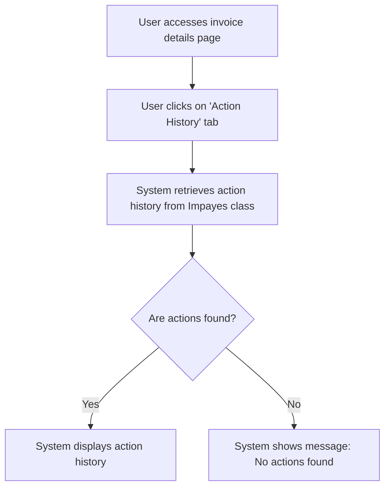

# Design: View Action History

## Technical Approach
The view action history feature will allow users to view the history of actions on an invoice. The system will retrieve the action history from the `Impayes` class and display it in a structured format, including action date, type, responsible user, and details. The frontend will use Alpine.js for reactivity and state management, while the backend will handle data retrieval via Flask.

## Architecture Decisions

### Decision: Use Alpine.js for Frontend Reactivity
- **Description**: Alpine.js will manage the state and reactivity of the action history display process.
- **Rationale**: Alpine.js is lightweight and integrates seamlessly with HTML, making it ideal for this use case.
- **Impact**: Simplifies frontend logic and improves user experience.

### Decision: Use Flask for Backend Processing
- **Description**: Flask will handle the retrieval of action history from the `Impayes` class.
- **Rationale**: Flask is lightweight and well-suited for handling HTTP requests and integrating with Parse.
- **Impact**: Ensures robust backend processing and easy integration with the database.

### Decision: Display Comprehensive Action History
- **Description**: The system will display a comprehensive history of actions, including all relevant details.
- **Rationale**: Comprehensive action history provides users with a complete view of the invoice's lifecycle.
- **Impact**: Enhances the usability and usefulness of the action history page.

### Decision: Provide Search and Sorting Options
- **Description**: The system will provide search and sorting options to allow users to find and organize specific actions.
- **Rationale**: Search and sorting options enhance usability by allowing users to quickly locate and manage relevant actions.
- **Impact**: Improves user experience by making it easier to find and manage action history.

## Data Flow


## Data Mapping

### Parse Class: `Impayes`
- **Fields**:
  - `numero_facture`: String (invoice number).
  - `historique_actions`: Array (list of action history).

### Parse Class: `Actions`
- **Fields**:
  - `date`: DateTime (date and time of the action).
  - `type`: String (type of the action).
  - `utilisateur`: Pointer (pointer to the user responsible for the action in the `_User` class).
  - `details`: String (details of the action).

### Alpine.js Store: `actionHistory`
- **Fields**:
  - `invoiceNumber`: String (invoice number).
  - `actionHistory`: Array (list of action history).
  - `searchQuery`: String (search query for filtering actions).
  - `sortCriteria`: String (selected sorting criteria).
  - `errorMessage`: String (error message to display).
  - `infoMessage`: String (informative message to display).

### Data Flow
1. **Input Data**:
   - The user accesses the invoice details page and clicks on the 'Action History' tab.
   - The system retrieves the action history from the `Impayes` class.

2. **Display**:
   - If actions are found, the system displays the action history, including action date, type, responsible user, and details.
   - If no actions are found, the system displays an informative message.

3. **Search and Sorting**:
   - The user inputs a search query or selects sorting criteria to organize the list of actions.
   - The system updates the action history display based on the search query and selected sorting criteria.

## Screen ASCII

### Screen 1: Action History
```
┌───────────────────────────────────────────────────────────────────────────────┐
│                                                                           │
│                                                                               │
│  Action History                                                              │
│  View the history of actions on the invoice                                  │
│                                                                               │
│  [Search Bar]                                                                │
│                                                                               │
│  Sort by:                                                                   │
│  [Date]  [Type]  [User]                                                      │
│                                                                               │
│  Action History:                                                            │
│  Date  │  Type  │  User  │  Details                                        │
│  15/01  │  Sent  │  User1  │  Follow-up email sent to client.              │
│  16/01  │  Paid  │  User2  │  Invoice marked as paid.                      │
│  17/01  │  Sent  │  User1  │  Follow-up email sent to client.              │
│                                                                               │
│                                                                           │
└───────────────────────────────────────────────────────────────────────────────┘
```

### Screen 2: No Actions Found
```
┌───────────────────────────────────────────────────────────────────────────────┐
│                                                                           │
│                                                                               │
│  No Actions Found                                                          │
│  No actions have been recorded for this invoice.                            │
│                                                                               │
│  [OK]                                                                       │
│                                                                               │
│                                                                           │
└───────────────────────────────────────────────────────────────────────────────┘
```

## Components and Layouts

### Components/Partials Usage

#### Invoice Details Component
- **File**: `/templates/partials/invoice_details_component.html`
- **Role**: Displays the details of an invoice and provides access to the action history.
- **Dependencies**:
  - `actionHistory` store for managing state.
  - `axiosParse` for API calls to Parse.

#### Action History Component
- **File**: `/templates/partials/action_history_component.html`
- **Role**: Displays the action history of an invoice with search and sorting options.
- **Dependencies**:
  - `actionHistory` store for managing state.

#### No Actions Found Component
- **File**: `/templates/partials/no_actions_found_component.html`
- **Role**: Displays a message when no actions are found for the invoice.
- **Dependencies**:
  - `actionHistory` store for managing state.

### Layouts

#### Base Layout
- **File**: `/templates/layouts/base_layout.html`
- **Role**: Provides the basic structure for all pages, including the header, footer, and main content area.

#### Dashboard Layout
- **File**: `/templates/layouts/dashboard_layout.html`
- **Role**: Provides the structure for dashboard pages, including the header, sidebar, and main content area.
- **Components Used**:
  - `sidebarComponent`

## Data Parse Changes

### Class: `Impayes`
- **Changes**: No changes required.

### Class: `Actions`
- **Changes**: No changes required.

## File Changes

### New Files
- `/templates/partials/invoice_details_component.html`: Component for displaying invoice details.
- `/templates/partials/action_history_component.html`: Component for displaying action history.
- `/templates/partials/no_actions_found_component.html`: Component for displaying messages when no actions are found.
- `/static/js/stores/actionHistoryStore.js`: Alpine.js store for managing action history state.

### Modified Files
- `/templates/layouts/base_layout.html`: Include the invoice details component.
- `/templates/layouts/dashboard_layout.html`: Include the action history component.

## Verification
Ensure the output file is created in the correct folder with the specified structure.