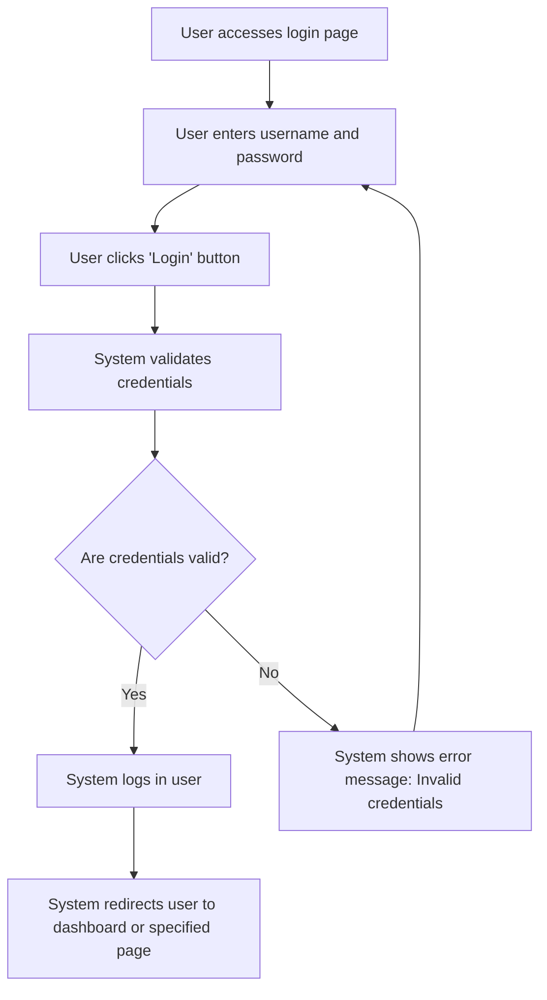

# Design: Login to the Application

## Technical Approach
The login feature will allow users to authenticate and access the application. The system will validate the user's credentials, manage the session, and redirect the user to the appropriate page. The frontend will use Alpine.js for reactivity and state management, while the backend will handle authentication and session management via Flask.

## Architecture Decisions

### Decision: Use Alpine.js for Frontend Reactivity
- **Description**: Alpine.js will manage the state and reactivity of the login process.
- **Rationale**: Alpine.js is lightweight and integrates seamlessly with HTML, making it ideal for this use case.
- **Impact**: Simplifies frontend logic and improves user experience.

### Decision: Use Flask for Backend Processing
- **Description**: Flask will handle the authentication and session management.
- **Rationale**: Flask is lightweight and well-suited for handling HTTP requests and integrating with Parse.
- **Impact**: Ensures robust backend processing and easy integration with the database.

### Decision: Encrypt Passwords
- **Description**: Passwords will be encrypted before being stored in the database.
- **Rationale**: Encryption ensures that passwords are secure and protected.
- **Impact**: Enhances security and protects sensitive user data.

### Decision: Secure Sessions
- **Description**: User sessions will be secured using tokens stored in localStorage or sessionStorage.
- **Rationale**: Securing sessions ensures that user data is protected and sessions are not hijacked.
- **Impact**: Improves security and user trust.

### Decision: Redirect After Login
- **Description**: The system will redirect the user to the dashboard or a specified page after successful login.
- **Rationale**: Redirection ensures that users are taken to the appropriate page after authentication.
- **Impact**: Enhances user experience by providing a seamless login process.

## Data Flow


## Data Mapping

### Parse Class: `_User`
- **Fields**:
  - `username`: String (user's username or email).
  - `password`: String (user's password).
  - `email`: String (user's email).
  - `sessionToken`: String (user's session token).

### Alpine.js Store: `login`
- **Fields**:
  - `username`: String (user's username or email).
  - `password`: String (user's password).
  - `rememberMe`: Boolean (indicates if the user wants to be remembered).
  - `errorMessage`: String (error message to display).

### Data Flow
1. **Input Data**:
   - The user enters their username and password on the login page.
   - The system captures the input and validates the credentials.

2. **Validation**:
   - The system validates the credentials against the `_User` class in Parse.
   - If the credentials are invalid, the system displays an error message.

3. **Login**:
   - If the credentials are valid, the system logs in the user and generates a session token.
   - The system stores the token in localStorage or sessionStorage based on the user's preference.

4. **Redirection**:
   - The system redirects the user to the dashboard or a specified page after successful login.

## Screen ASCII

### Screen 1: Login Page
```
┌───────────────────────────────────────────────────────────────────────────────┐
│                                                                           │
│                                                                               │
│  Login to the Application                                                  │
│  Enter your username and password to access the application                 │
│                                                                               │
│  Username: [________________________________________________________________]   │
│  Password: [________________________________________________________________]   │
│                                                                               │
│  [ ] Remember Me                                                           │
│                                                                               │
│  [Login]  [Cancel]                                                          │
│                                                                               │
│                                                                           │
└───────────────────────────────────────────────────────────────────────────────┘
```

### Screen 2: Error Message
```
┌───────────────────────────────────────────────────────────────────────────────┐
│                                                                           │
│                                                                               │
│  Error                                                                      │
│  Invalid credentials. Please try again.                                      │
│                                                                               │
│  [Retry]  [Cancel]                                                           │
│                                                                               │
│                                                                           │
└───────────────────────────────────────────────────────────────────────────────┘
```

## Components and Layouts

### Components/Partials Usage

#### Login Component
- **File**: `/templates/partials/login_component.html`
- **Role**: Handles the login process, including capturing user credentials and displaying error messages.
- **Dependencies**:
  - `login` store for managing state.
  - `axiosParse` for API calls to Parse.

#### Error Message Component
- **File**: `/templates/partials/error_message_component.html`
- **Role**: Displays error messages during the login process.
- **Dependencies**:
  - `login` store for managing state.

### Layouts

#### Base Layout
- **File**: `/templates/layouts/base_layout.html`
- **Role**: Provides the basic structure for all pages, including the header, footer, and main content area.

#### Login Layout
- **File**: `/templates/layouts/login_layout.html`
- **Role**: Provides the structure for the login page, including the login form and error messages.

## Data Parse Changes

### Class: `_User`
- **Changes**: No changes required.

## File Changes

### New Files
- `/templates/partials/login_component.html`: Component for handling the login process.
- `/templates/partials/error_message_component.html`: Component for displaying error messages.
- `/static/js/stores/loginStore.js`: Alpine.js store for managing login state.

### Modified Files
- `/templates/layouts/base_layout.html`: Include the login component.
- `/templates/layouts/login_layout.html`: Include the error message component.

## Verification
Ensure the output file is created in the correct folder with the specified structure.