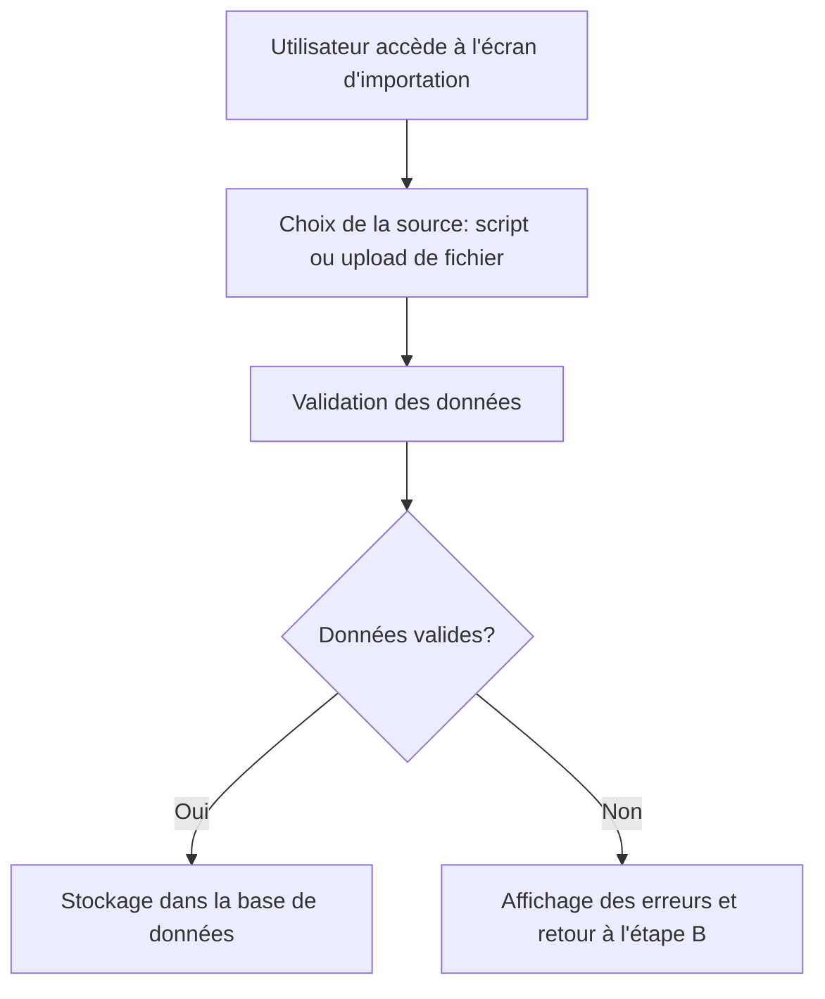

# Feature: Importation des Factures Impayées

## Description
Permettre l'importation des factures impayées via un script ou un upload de fichiers depuis une base de données externe ou un fichier. Les factures importées doivent être validées et stockées dans la base de données.

## User Flow
