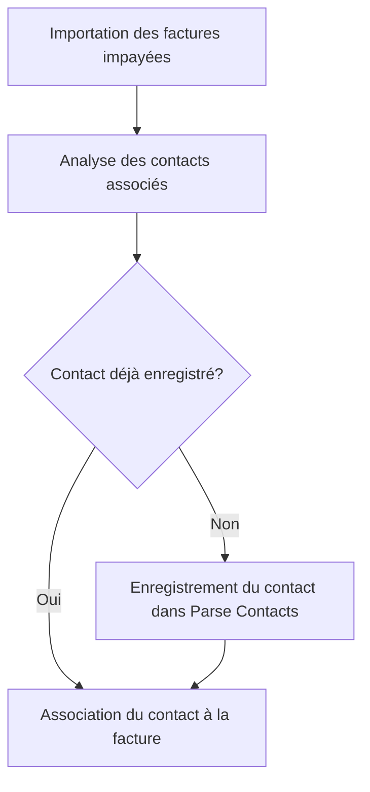

# Feature: Identification des Contacts

## Description
Identifier et enregistrer les contacts (payeurs ou apporteurs d'affaires) dans la classe Parse Contacts lors de l'import des factures impayées. Les contacts doivent être associés aux factures correspondantes.

## User Flow
