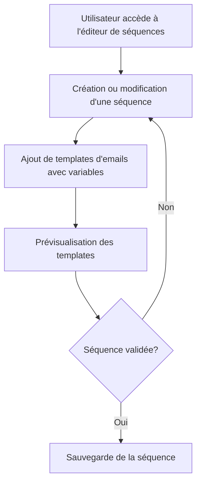

# Feature: Gestion des Séquences d'Emails

## Description
Créer et modifier des séquences d'emails avec des templates éditables via Toast Editor UI. Les séquences doivent inclure des variables dynamiques basées sur les colonnes de la classe Impayés.

## User Flow
