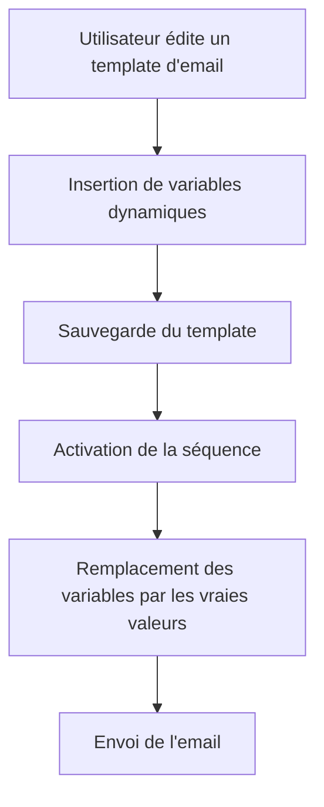

# Feature: Intégration des Variables

## Description
Utiliser des variables (ex: `[[variable]]`) dans les templates d'emails, basées sur les colonnes de la classe Impayés. Les variables doivent être remplacées par les vraies valeurs lors de l'envoi des emails.

## User Flow
