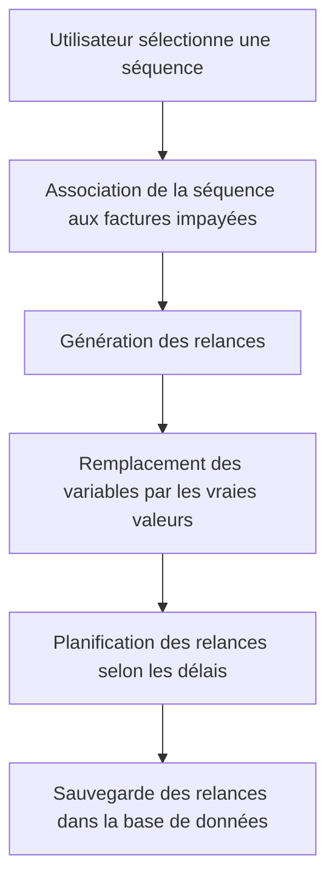

# Feature: Activation des Séquences

## Description
Associer des séquences aux factures impayées et générer des relances avec des variables remplacées par les vraies valeurs. Les relances doivent être planifiées selon les délais configurés.

## User Flow
