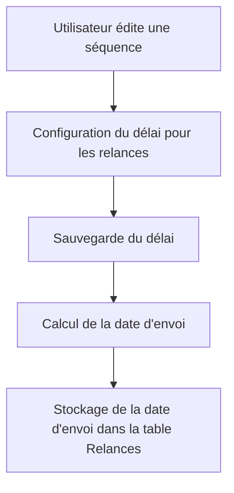

# Feature: Gestion des Délais

## Description
Configurer des délais pour les relances, stockés dans la colonne `date_envoi` de la table Relances. Les délais déterminent quand les emails de relance doivent être envoyés.

## User Flow
