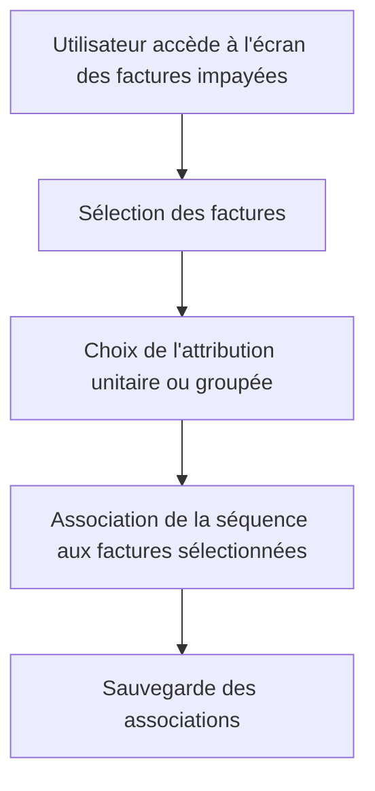

# Feature: Attribution des Séquences

## Description
Attribuer des séquences aux factures impayées de manière unitaire ou groupée (par payeur ou contact). Les séquences doivent être associées aux factures pour générer les relances.

## User Flow
