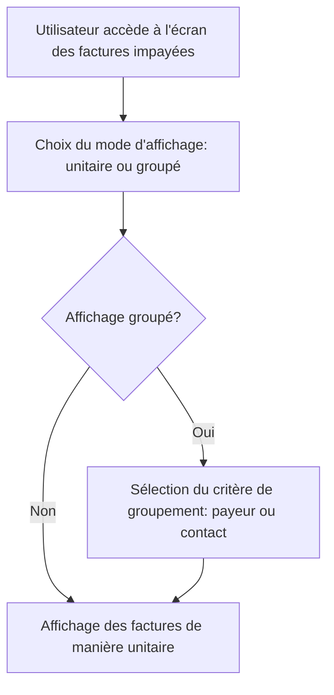

# Feature: Affichage des Factures Impayées

## Description
Afficher les factures impayées de manière unitaire ou groupée (par payeur ou contact), incluant les détails des contacts et les actions associées.

## User Flow
