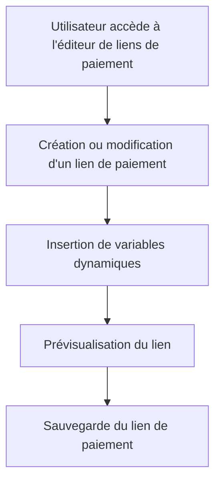

# Feature: Gestion des Liens de Paiement

## Description
Créer et éditer des liens de paiement avec des variables, accessibles via un drawer/slider. Les liens de paiement doivent être intégrés dans les templates d'emails.

## User Flow
