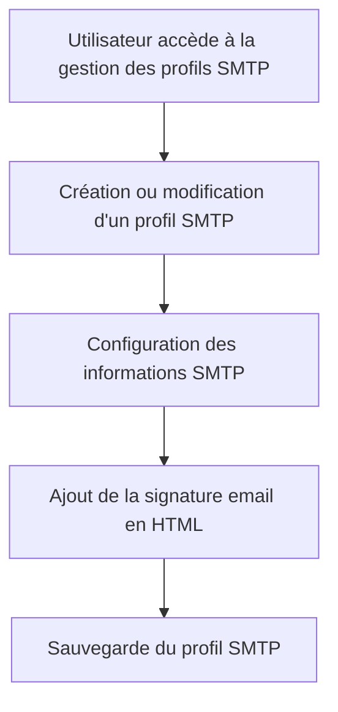

# Feature: Profils SMTP

## Description
Configurer et gérer des profils SMTP pour l'envoi d'emails, incluant la signature email en HTML. Les profils SMTP doivent être utilisés pour envoyer les emails de relance.

## User Flow
