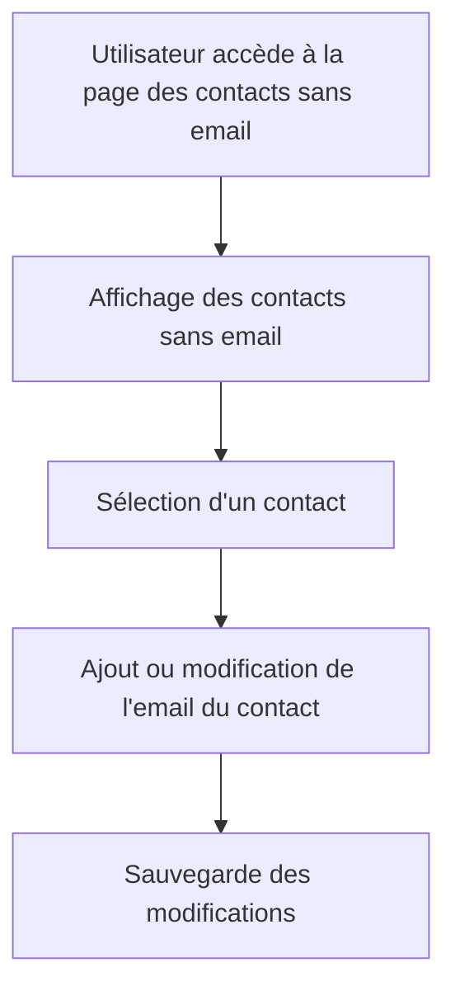

# Feature: Gestion des Contacts Sans Email

## Description
Afficher une page spéciale pour les contacts sans email, avec leur montant et le nombre de factures associées. L'utilisateur peut prendre des mesures pour ajouter des emails aux contacts.

## User Flow
