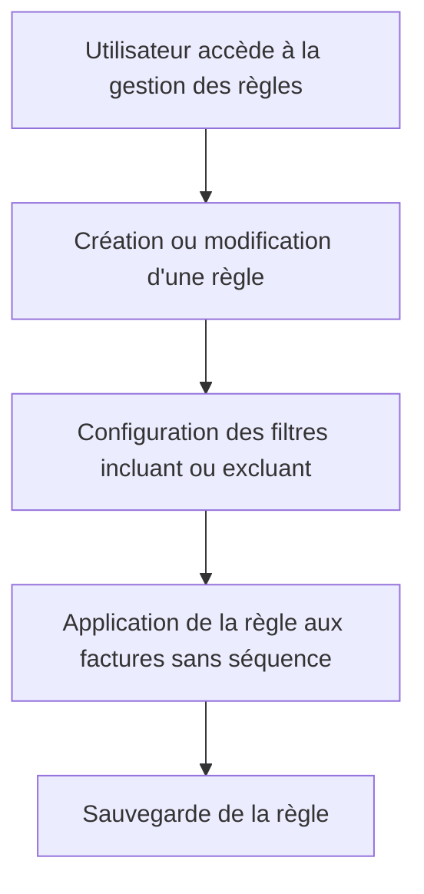

# Feature: Règles d'Attribution Automatique

## Description
Créer des règles pour attribuer automatiquement des séquences aux factures impayées, avec des filtres incluant ou excluant. Les règles doivent être appliquées aux factures sans séquence associée.

## User Flow
