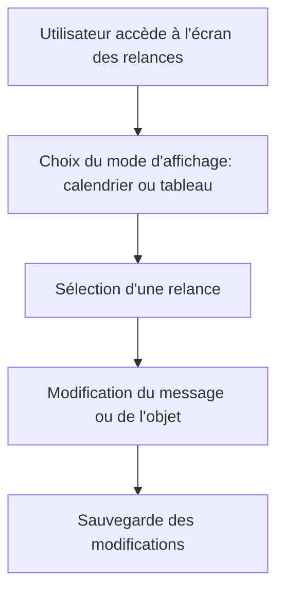

# Feature: Affichage des Relances

## Description
Afficher les relances dans un calendrier ou un tableau, avec possibilité de modifier les messages avant envoi. Les relances doivent être visualisées et modifiées avant leur envoi.

## User Flow
