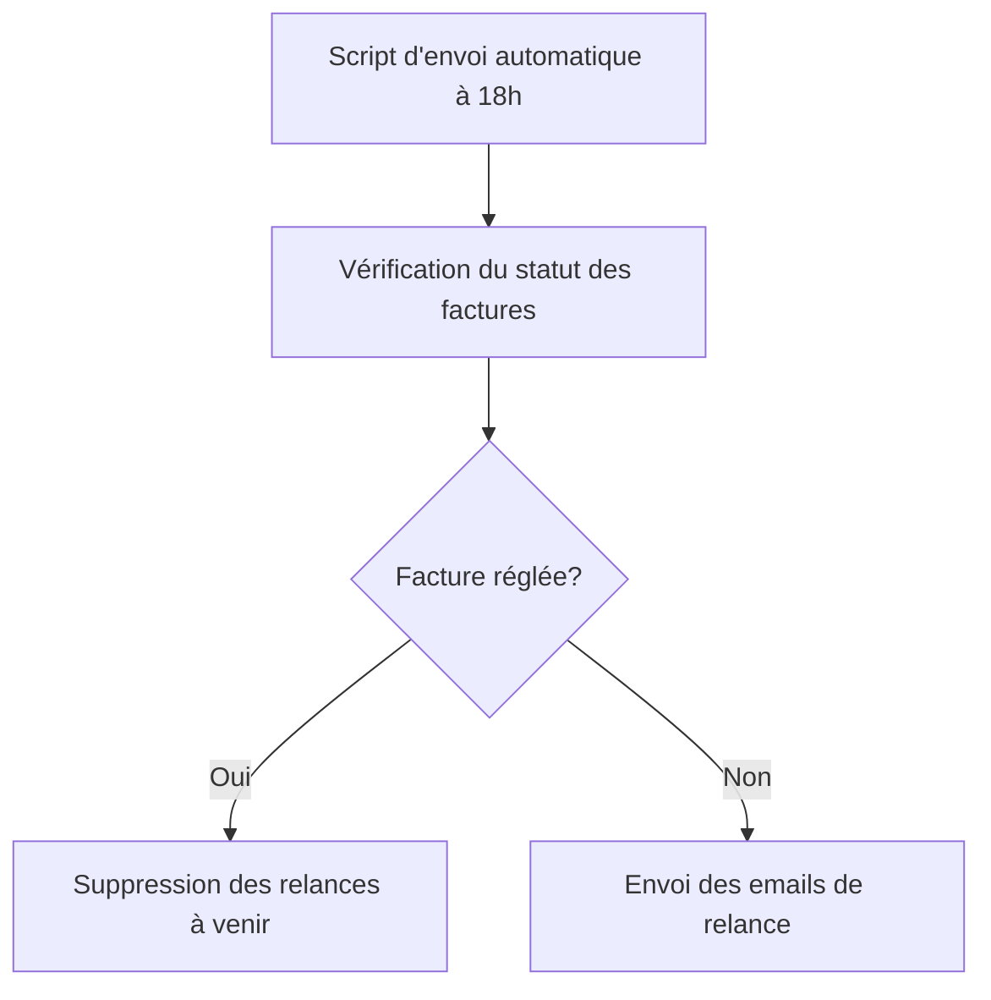

# Feature: Envoi Automatique des Emails

## Description
Envoyer les emails de relance quotidiennement à 18h, avec vérification préalable du statut des factures. Si une facture est réglée, les relances à venir doivent être supprimées.

## User Flow
