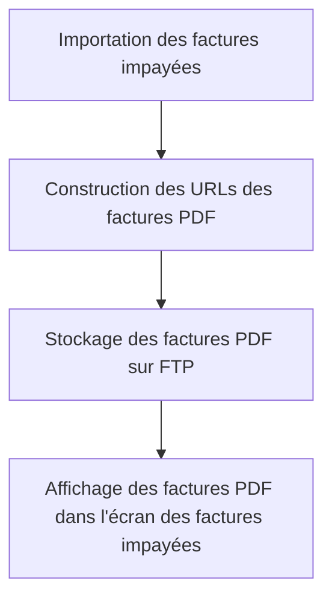

# Feature: Gestion des Factures PDF

## Description
Stocker et afficher les factures PDF via un FTP, avec construction des URLs lors de l'import. Les factures PDF doivent être accessibles depuis l'écran des factures impayées.

## User Flow
