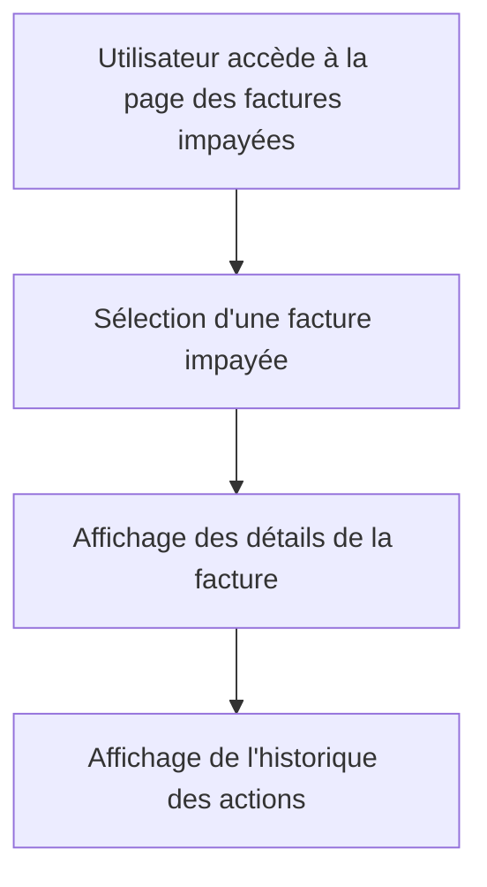

# Feature: Page Détails des Factures Impayées

## Description
Afficher toutes les informations et actions pour une facture impayée, incluant l'historique. La page doit permettre de visualiser les détails et les actions associées à une facture impayée.

## User Flow
