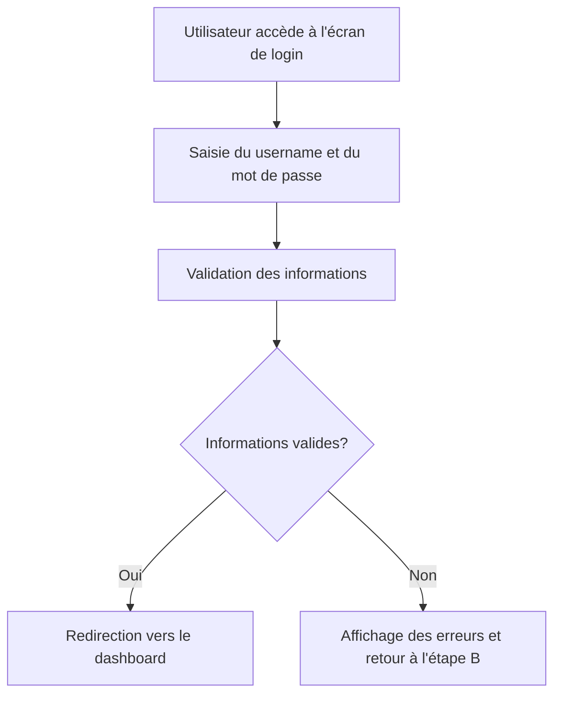

# Feature: Authentification et Dashboard

## Description
Créer un écran de login avec un username et un dashboard avec des informations pertinentes. L'utilisateur doit pouvoir se connecter et accéder à un dashboard personnalisé.

## User Flow
