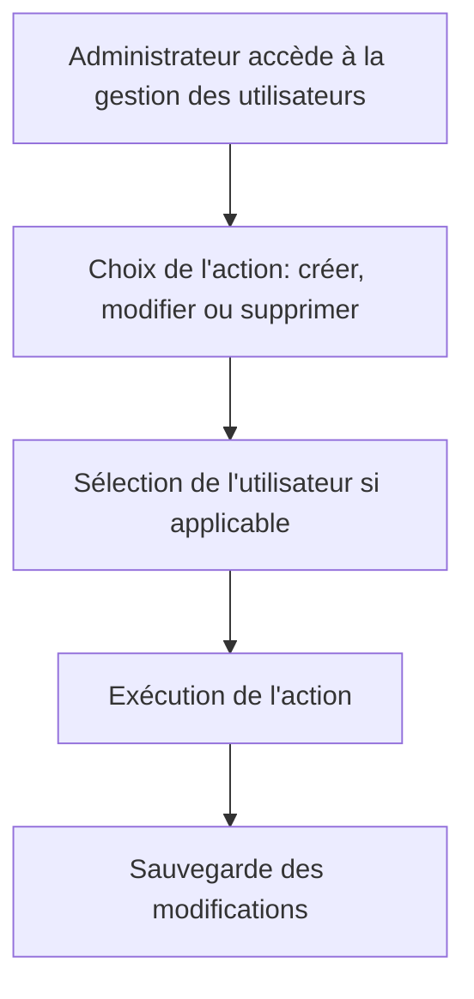

# Feature: Gestion des Utilisateurs

## Description
Permettre aux administrateurs (`admin=true`) de gérer les utilisateurs de leur équipe. Les administrateurs doivent pouvoir créer, modifier et supprimer des utilisateurs.

## User Flow
