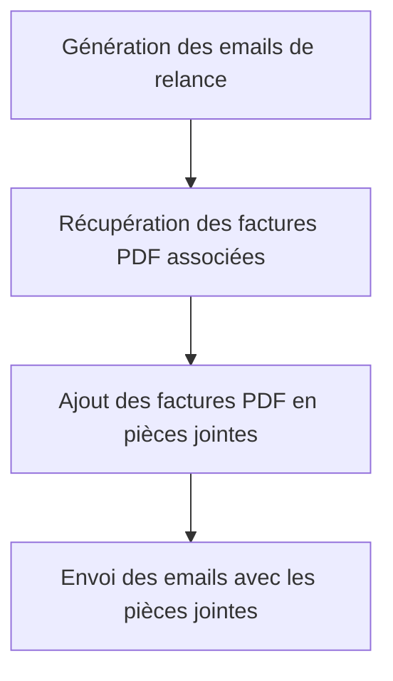

# Feature: Pièces Jointes des Factures

## Description
Joindre les factures PDF aux emails de relance. Les factures PDF doivent être incluses dans les emails envoyés.

## User Flow

```mermaid
graph TD
    A[Génération des emails de relance] --> B[Récupération des factures PDF associées]
    B --> C[Ajout des factures PDF en pièces jointes]
    C --> D[Envoi des emails avec les pièces jointes]
```