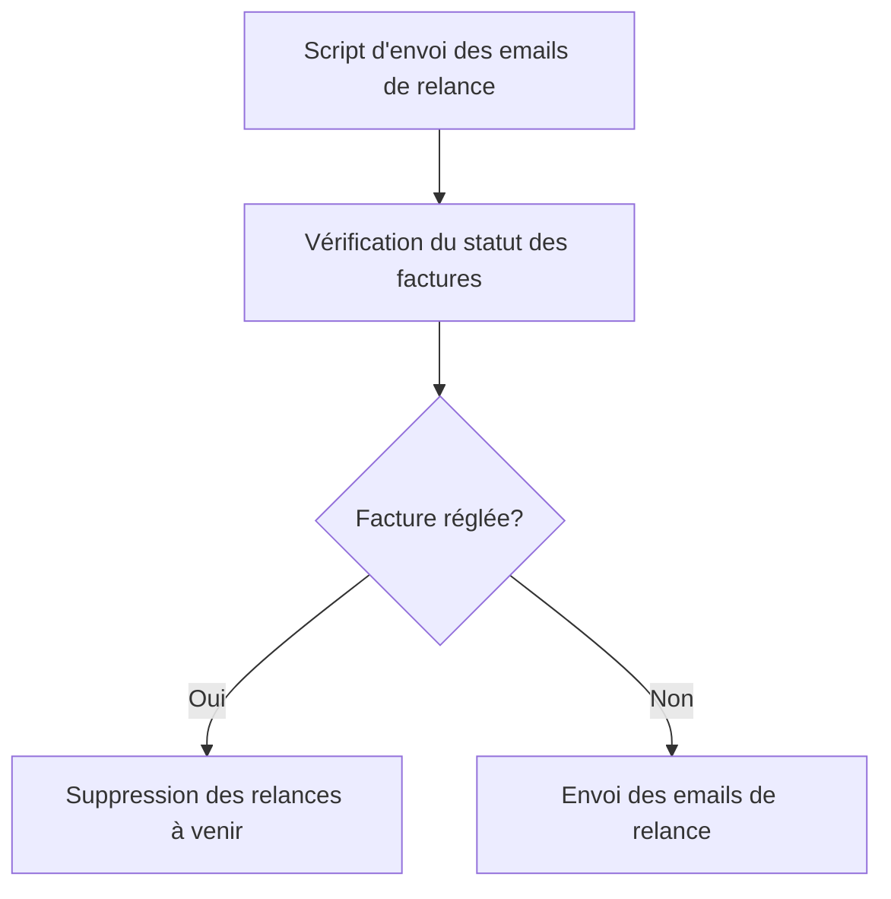

# Feature: Vérification des Factures Réglées

## Description
Vérifier si une facture est réglée avant l'envoi des relances. Si la facture est réglée, les relances à venir doivent être supprimées.

## User Flow
