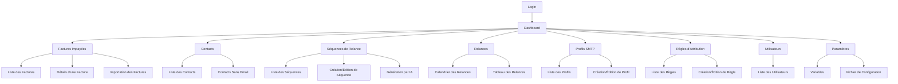

# Sitemap: Relances Automatiques Factures Impayées

## Description
Ce sitemap décrit la structure des pages et des écrans de l'application de relances automatiques de factures impayées. Il inclut les principales sections et sous-sections de l'application.

## Structure

### 1. Authentification
- **Login** (`/login`)
  - Formulaire de connexion avec username et mot de passe.
  - Lien pour la récupération de mot de passe.

### 2. Dashboard
- **Tableau de Bord** (`/dashboard`)
  - Résumé des factures impayées.
  - Statistiques des relances envoyées.
  - Alertes pour les factures urgentes.

### 3. Factures Impayées
- **Liste des Factures** (`/impayes`)
  - Affichage unitaire ou groupé (par payeur ou contact).
  - Filtres pour rechercher des factures spécifiques.
  - Actions pour attribuer des séquences ou exporter les données.

- **Détails d'une Facture** (`/impayes/:id`)
  - Informations détaillées sur la facture.
  - Historique des actions et relances.
  - Accès aux factures PDF.

- **Importation des Factures** (`/impayes/import`)
  - Upload de fichiers ou importation via un script.
  - Validation et stockage des factures.

### 4. Contacts
- **Liste des Contacts** (`/contacts`)
  - Affichage des contacts avec leurs informations.
  - Filtres pour rechercher des contacts spécifiques.

- **Contacts Sans Email** (`/contacts/sans-email`)
  - Liste des contacts sans adresse email.
  - Actions pour ajouter ou modifier des emails.

### 5. Séquences de Relance
- **Liste des Séquences** (`/sequences`)
  - Affichage des séquences existantes.
  - Actions pour créer, modifier ou supprimer des séquences.

- **Création/Édition de Séquence** (`/sequences/edit/:id`)
  - Éditeur de séquences avec Toast Editor UI.
  - Gestion des templates d'emails.
  - Configuration des délais et des liens de paiement.

- **Génération par IA** (`/sequences/generate-ai`)
  - Intégration avec ChatGPT pour générer des séquences.
  - Synchronisation des séquences générées.

### 6. Relances
- **Calendrier des Relances** (`/relances/calendrier`)
  - Affichage des relances dans un calendrier.
  - Actions pour modifier les messages avant envoi.

- **Tableau des Relances** (`/relances/tableau`)
  - Affichage des relances dans un tableau.
  - Filtres pour rechercher des relances spécifiques.

### 7. Profils SMTP
- **Liste des Profils** (`/smtp-profiles`)
  - Affichage des profils SMTP existants.
  - Actions pour créer, modifier ou supprimer des profils.

- **Création/Édition de Profil** (`/smtp-profiles/edit/:id`)
  - Configuration des informations SMTP.
  - Ajout de la signature email en HTML.

### 8. Règles d'Attribution
- **Liste des Règles** (`/regles`)
  - Affichage des règles d'attribution automatique.
  - Actions pour créer, modifier ou supprimer des règles.

- **Création/Édition de Règle** (`/regles/edit/:id`)
  - Configuration des filtres (incluant ou excluant).
  - Association des séquences aux règles.

### 9. Utilisateurs
- **Liste des Utilisateurs** (`/utilisateurs`)
  - Affichage des utilisateurs de l'équipe.
  - Actions pour créer, modifier ou supprimer des utilisateurs (réservé aux administrateurs).

### 10. Paramètres
- **Variables** (`/parametres/variables`)
  - Liste des variables disponibles pour les templates.
  - Actions pour ajouter ou modifier des variables.

- **Fichier de Configuration** (`/parametres/config`)
  - Accès au fichier `/static/configs/variables.json`.
  - Actions pour mettre à jour le fichier de configuration.

## Diagramme de Navigation

## Notes
- Les pages accessibles dépendent des permissions de l'utilisateur (e.g., les administrateurs ont accès à la gestion des utilisateurs).
- Les liens de navigation sont dynamiques et dépendent du contexte (e.g., les actions disponibles sur une facture dépendent de son statut).