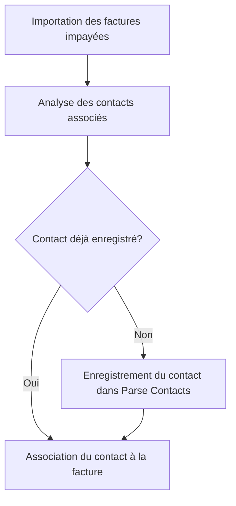

# Use Case: Identification des Contacts

## Description
Le système identifie les contacts (payeurs ou apporteurs d'affaires) dans les factures importées. Les contacts sont enregistrés dans la classe Parse Contacts.

## User Flow


## ASCII Screen
```
+---------------------------------------------------------------+
|  Identification des Contacts                                  |
|                                                               |
|  Contacts identifiés:                                          |
|  - Payeur: Jean Dupont                                         |
|  - Apporteur d'affaires: Marie Martin                         |
|                                                               |
|  [Enregistrer] [Annuler]                                       |
+---------------------------------------------------------------+
```