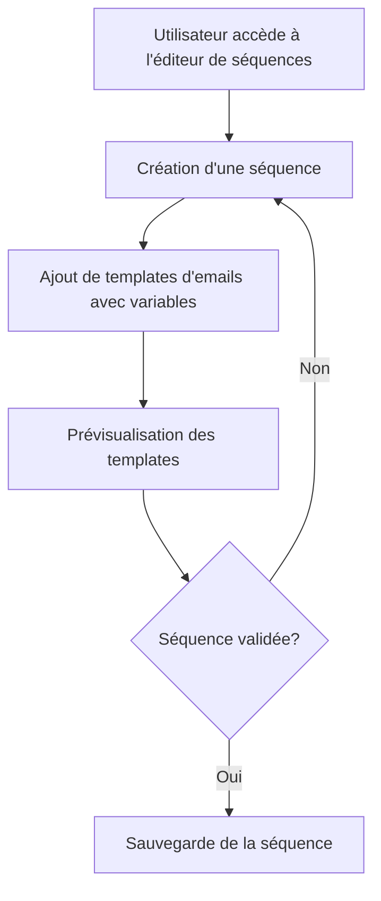

# Use Case: Création de Séquences d'Emails

## Description
L'utilisateur crée une séquence d'emails avec des templates éditables via Toast Editor UI. Les variables (ex: `[[variable]]`) sont intégrées dans les templates.

## User Flow


## ASCII Screen
```
+---------------------------------------------------------------+
|  Création de Séquences d'Emails                              |
|                                                               |
|  Nom de la séquence: [_____________________________________]  |
|                                                               |
|  Templates:                                                    |
|  [Ajouter un template] [Prévisualiser] [Sauvegarder]          |
|                                                               |
|  Variables disponibles: [[nom]], [[montant]], [[date]]        |
+---------------------------------------------------------------+
```