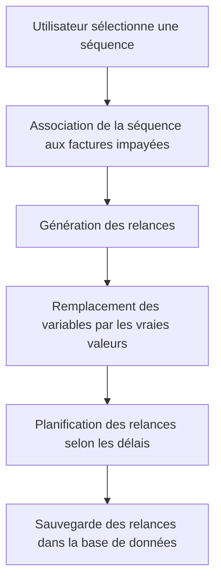

# Use Case: Activation des Séquences

## Description
L'utilisateur active une séquence pour une ou plusieurs factures impayées. Le système génère des relances avec les variables remplacées par les vraies valeurs.

## User Flow


## ASCII Screen
```
+---------------------------------------------------------------+
|  Activation des Séquences                                     |
|                                                               |
|  Séquence sélectionnée: Relance Standard                      |
|                                                               |
|  Factures associées:                                          |
|  - Facture 001: Jean Dupont                                    |
|  - Facture 002: Marie Martin                                  |
|                                                               |
|  [Activer] [Annuler]                                           |
+---------------------------------------------------------------+
```