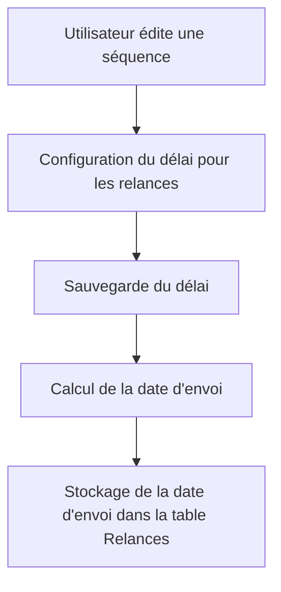

# Use Case: Gestion des Délais

## Description
L'utilisateur configure un délai pour les relances. Le système stocke la date d'envoi dans la colonne `date_envoi` de la table Relances.

## User Flow


## ASCII Screen
```
+---------------------------------------------------------------+
|  Gestion des Délais                                            |
|                                                               |
|  Délai (jours): [____]                                         |
|                                                               |
|  Date d'envoi calculée: 15/10/2023                             |
|                                                               |
|  [Sauvegarder] [Annuler]                                       |
+---------------------------------------------------------------+
```