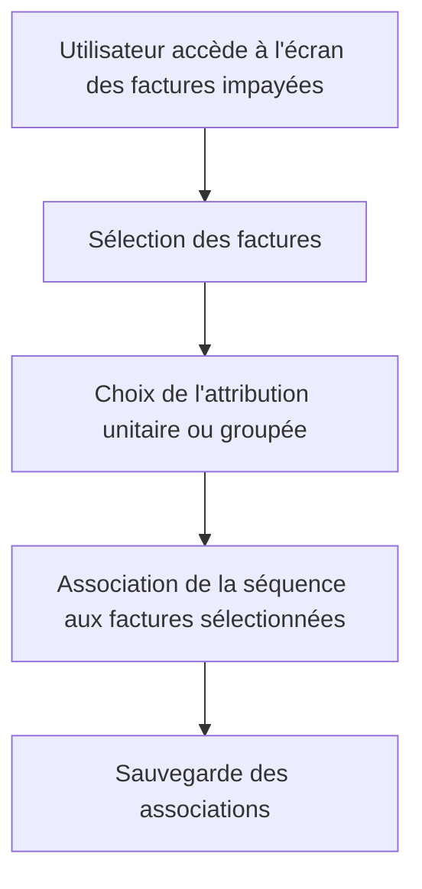

# Use Case: Attribution des Séquences

## Description
L'utilisateur attribue une séquence à une facture impayée de manière unitaire ou groupée (par payeur ou contact). Le système met à jour les associations dans la base de données.

## User Flow


## ASCII Screen
```
+---------------------------------------------------------------+
|  Attribution des Séquences                                    |
|                                                               |
|  Factures sélectionnées:                                       |
|  - Facture 001: Jean Dupont                                    |
|  - Facture 002: Marie Martin                                  |
|                                                               |
|  Séquence à attribuer: [Relance Standard ▼]                  |
|                                                               |
|  [Attribuer] [Annuler]                                         |
+---------------------------------------------------------------+
```