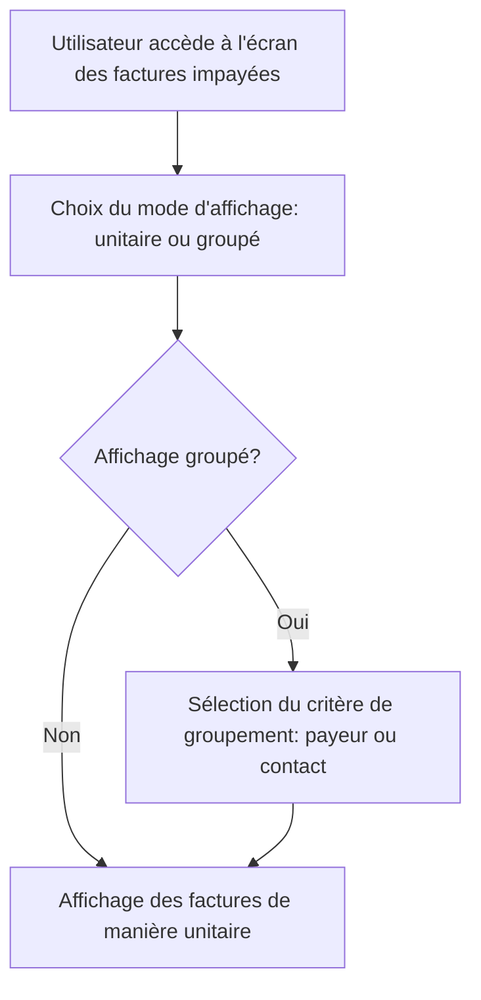

# Use Case: Affichage des Factures Impayées

## Description
L'utilisateur visualise les factures impayées de manière unitaire ou groupée (par payeur ou contact). Le système affiche les détails des factures et les actions associées.

## User Flow


## ASCII Screen
```
+---------------------------------------------------------------+
|  Affichage des Factures Impayées                              |
|                                                               |
|  Mode d'affichage: [Unitaire ▼] [Groupé ▼]                    |
|                                                               |
|  Factures:                                                     |
|  - Facture 001: Jean Dupont - Montant: 1000€                   |
|  - Facture 002: Marie Martin - Montant: 1500€                 |
|                                                               |
|  [Voir les détails] [Exporter]                                |
+---------------------------------------------------------------+
```