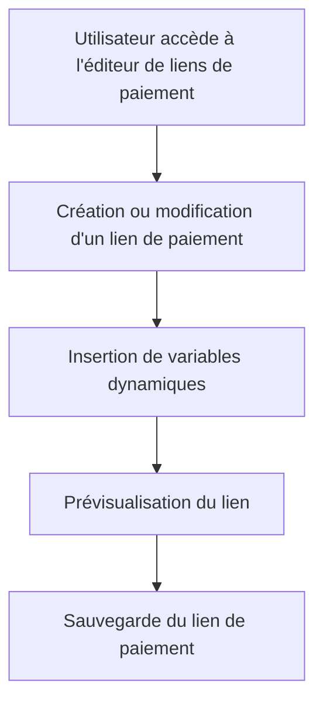

# Use Case: Gestion des Liens de Paiement

## Description
L'utilisateur crée et édite un lien de paiement avec des variables via un drawer/slider. Le système stocke le lien de paiement et permet de le copier-coller.

## User Flow


## ASCII Screen
```
+---------------------------------------------------------------+
|  Gestion des Liens de Paiement                                |
|                                                               |
|  Lien de paiement: [_____________________________________]  |
|                                                               |
|  Variables disponibles: [[montant]], [[reference]]            |
|                                                               |
|  [Prévisualiser] [Copier] [Sauvegarder]                       |
+---------------------------------------------------------------+
```