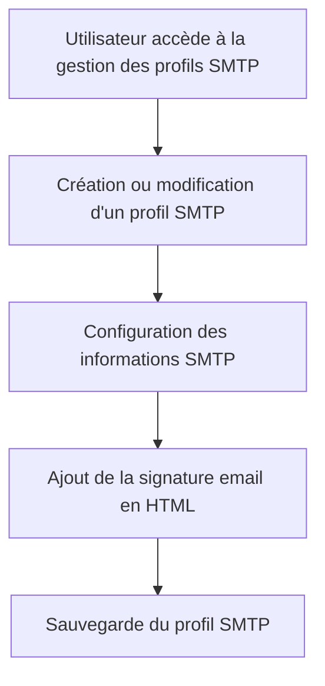

# Use Case: Configuration des Profils SMTP

## Description
L'utilisateur configure un profil SMTP pour l'envoi d'emails, incluant la signature email en HTML. Le système stocke les informations SMTP et la signature email.

## User Flow


## ASCII Screen
```
+---------------------------------------------------------------+
|  Configuration des Profils SMTP                                |
|                                                               |
|  Serveur SMTP: [_________________________________________]     |
|  Port: [____]                                                 |
|  Signature email: [_______________________________________]     |
|                                                               |
|  [Sauvegarder] [Annuler]                                       |
+---------------------------------------------------------------+
```