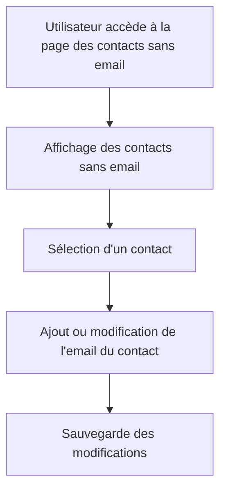

# Use Case: Gestion des Contacts Sans Email

## Description
Le système affiche une page spéciale pour les contacts sans email, avec leur montant et le nombre de factures associées. L'utilisateur peut prendre des mesures pour ajouter des emails aux contacts.

## User Flow


## ASCII Screen
```
+---------------------------------------------------------------+
|  Gestion des Contacts Sans Email                              |
|                                                               |
|  Contacts sans email:                                          |
|  - Jean Dupont - Montant: 1000€ - Factures: 2                  |
|  - Marie Martin - Montant: 1500€ - Factures: 3                |
|                                                               |
|  [Ajouter un email] [Exporter]                                |
+---------------------------------------------------------------+
```